Задание 10

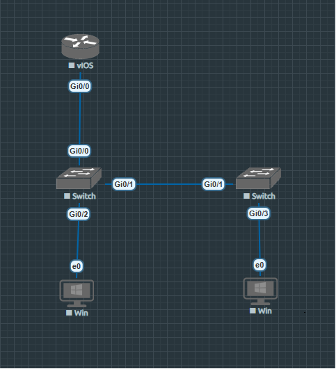

Таблица адресации

|**Устройство**|**interface/vlan**|**IP-адрес**|**Маска подсети**|
| :-: | :-: | :-: | :-: |
|R1|G0/0|192\.168.10.1|255\.255.255.0|
|*R1*|Loopback 0 |10\.10.1.1|255\.255.255.0|
|S1|VLAN 10|192\.168.10.201|255\.255.255.0|
|S2|VLAN 10|192\.168.10.202|255\.255.255.0|
|PC A|NIC|DHCP|255\.255.255.0|
|PC B|NIC|DHCP|255\.255.255.0|

**ШАГ 1: Настройка R1** 

R1#enable

R1#configure terminal

R1(config)#hostname R1

R1(config)#no ip domain lookup

R1(config)#ip dhcp excluded-address 192.168.10.1 192.168.10.9

R1(config)#ip dhcp excluded-address 192.168.10.201 192.168.10.202

R1(config)#ip dhcp relay information trust-all

R1(config)#ip dhcp pool Students

R1(dhcp-config)# network 192.168.10.0 255.255.255.0

R1(dhcp-config)# default-router 192.168.10.1

R1(dhcp-config)# domain-name otus.lab

R1(dhcp-config)#interface Loopback0

R1(config-if)# ip address 10.10.1.1 255.255.255.0

R1(config-if)# interface GigabitEthernet0/0

R1(config-if)# description Link to S1

R1(config-if)# ip address 192.168.10.1 255.255.255.0

R1(config-if)# no shutdown

R1(config-if)# line con 0

R1(config-line)# logging synchronous

R1(config-line)# exec-timeout 0 0

R1(config-line)#end

**Проверка конфигурации R1:**

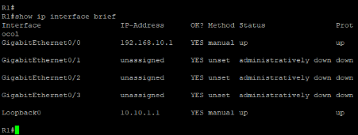

**Часть 2: Настройка сетей VLAN**

**Базовая настройка коммутаторов S1 и S2:**

**На S1:**

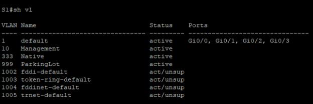

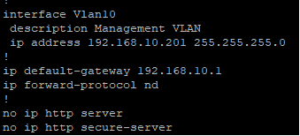

**На S2:**

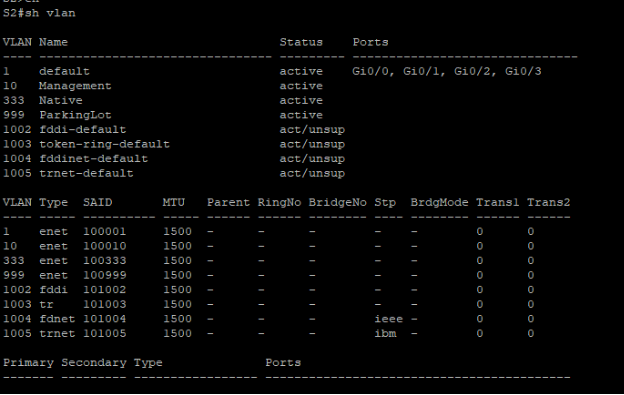

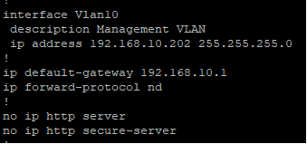

**Часть 3: Настройки безопасности коммутатора**

**1. Настройка магистральных соединений 802.1Q**

**На S1:**

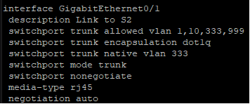

**На S2:**

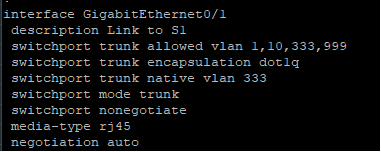

**Проверка магистральных портов:**

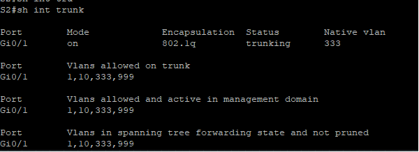

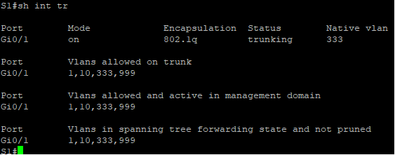

**2. Настройка портов доступа**

**На S1:**

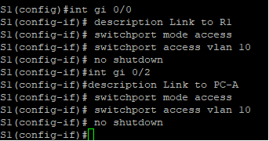

**На S2:**

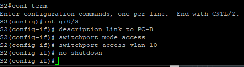

**3. Безопасность неиспользуемых портов**

**На S1 и S2:**

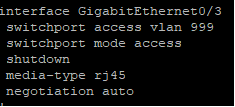

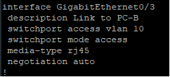

**Проверка состояния портов:**

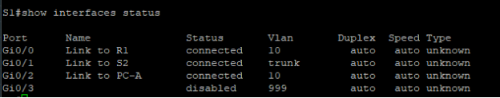

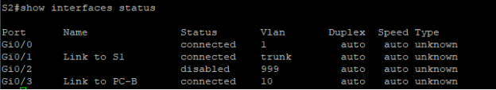

**4. Безопасность портов (Port Security)**

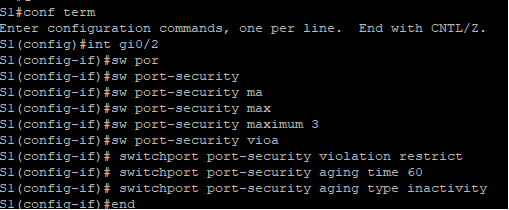

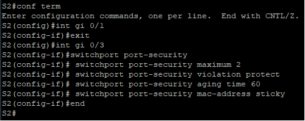

**Проверка безопасности портов:**

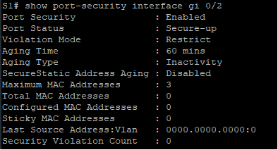

**5. DHCP Snooping (только на S2)**

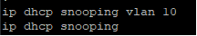

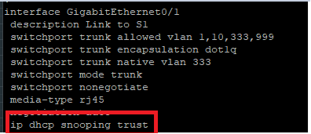

**Проверка DHCP Snooping:**

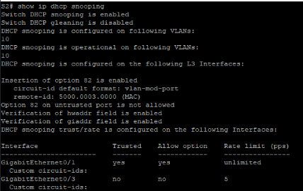
**\

**Ответы на вопросы для повторения**

**1. Почему нет значения таймера для оставшегося возраста на S2 F0/18?**

**Ответ:** На порту F0/18 S2 настроен режим sticky MAC addresses с типом старения absolute. При использовании sticky MAC адресов с абсолютным типом старения, адреса не стареют автоматически - они сохраняются в running-config и могут быть сохранены в startup-config. Поэтому нет отсчета времени оставшегося возраста.

**2. Почему PC-B не получит IP-адрес через DHCP после перезагрузки S2?**

**Ответ:** После перезагрузки S2, если скрипт текущей конфигурации загружен, порт F0/18 будет иметь sticky MAC адрес PC-B в конфигурации. Однако если PC-B изменит свой MAC-адрес (например, при замене сетевой карты) или попытается подключиться другое устройство, порт безопасности не позволит новому устройству получить доступ к сети, так как максимальное количество MAC-адресов (2) уже будет занято сохраненными sticky адресами.

**3. В чем разница между absolute и inactivity aging типами?**

**Ответ:**

- **Absolute aging:** Таймер начинает отсчет с момента добавления MAC-адреса в таблицу безопасности. Адрес удаляется по истечении заданного времени, независимо от активности.
- **Inactivity aging:** Таймер сбрасывается при каждом поступлении пакета от MAC-адреса. Адрес удаляется только если в течение заданного времени от него не было трафика.

