Задание 11 

Топология 

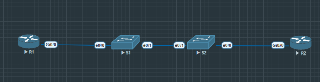

Таблица Адресации 

|**Устройство**|**Интерфейс**|**IP-адрес**|**Маска подсети** |
| :-: | :-: | :-: | :-: |
|R1|G0/0|10\.53.0.1|255\.255.255.0|
|*R1*|Loopback1|172\.16.1.1|255\.255.255.0|
|R2|G0/0|10\.53.0.2|255\.255.255.0|
|*R2*|Loopback1|192\.168.1.1|255\.255.255.0|

**Часть 1: Создание сети и настройка основных параметров устройства**

**Шаг 1: Базовая настройка маршрутизаторов**

**На R1:**

Router> enable

Router# configure terminal

Router(config)# hostname R1

R1(config)# enable secret class

R1(config)# service password-encryption

R1(config)# line console 0

R1(config-line)# password cisco

R1(config-line)# login

R1(config-line)# exit

R1(config)# line vty 0 15

R1(config-line)# password cisco

R1(config-line)# login

R1(config-line)# exit

R1(config)# no ip domain-lookup

R1(config)# banner motd # Unauthorized access is prohibited! #

R1(config)# exit

R1# copy run st

**На R2:**

Router> enable

Router# configure terminal

Router(config)# hostname R2

R2(config)# enable secret class

R2(config)# service password-encryption

R2(config)# line console 0

R2(config-line)# password cisco

R2(config-line)# login

R2(config-line)# exit

R2(config)# line vty 0 15

R2(config-line)# password cisco

R2(config-line)# login

R2(config-line)# exit

R2(config)# no ip domain-lookup

R2(config)# banner motd # Unauthorized access is prohibited! #

R2(config)# exit

R2# copy run st

**Шаг 2: Базовая настройка коммутаторов**

**На S1:**

Switch> enable

Switch# configure terminal

Switch(config)# hostname S1

S1(config)# enable secret class

S1(config)# service password-encryption

S1(config)# line console 0

S1(config-line)# password cisco

S1(config-line)# login

S1(config-line)# exit

S1(config)# line vty 0 15

S1(config-line)# password cisco

S1(config-line)# login

S1(config-line)# exit

S1(config)# no ip domain-lookup

S1(config)# banner motd # Unauthorized access is prohibited! #

S1(config)# exit

S1# copy run st

**На S2:**

Switch> enable

Switch# configure terminal

Switch(config)# hostname S2

S2(config)# enable secret class

S2(config)# service password-encryption

S2(config)# line console 0

S2(config-line)# password cisco

S2(config-line)# login

S2(config-line)# exit

S2(config)# line vty 0 15

S2(config-line)# password cisco

S2(config-line)# login

S2(config-line)# exit

S2(config)# no ip domain-lookup

S2(config)# banner motd # Unauthorized access is prohibited! #

S2(config)# exit

S2# copy run st

**Часть 2: Настройка и проверка базовой работы OSPFv2**

**Шаг 1: Настройка IP-адресов интерфейсов**

**На R1:**

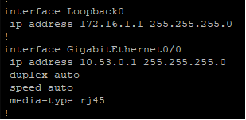

**На R2:**

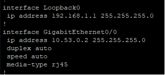

**Шаг 2: Настройка OSPFv2**

**На R1:**

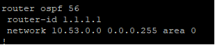

**На R2:**

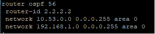

**Шаг 3: Проверка смежности OSPF**

**На R1:**

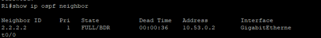

**Ответ на вопрос:**

- DR (Designated Router): R1 (так как имеет более высокий IP-адрес)
- BDR (Backup Designated Router): R2
- Критерии выбора: Приоритет (по умолчанию 1) и Router ID (более высокий предпочтительнее).

Шаг 4: Проверка таблицы маршрутизации

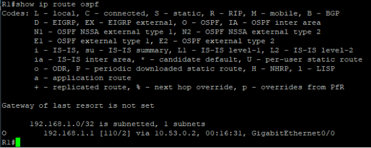

**Шаг 5: Проверка связи**

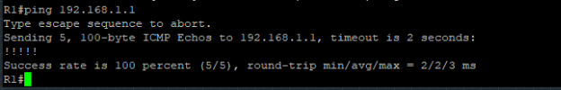

**Часть 3: Оптимизация и проверка конфигурации OSPFv2**

Шаг 1: Настройка приоритета OSPF на R1

R1(config)# interface g0/0/1

R1(config-if)# ip ospf priority 50

R1(config-if)# exit

Шаг 2: Настройка таймеров OSPF

**На R1 и R2:**

R1(config)# interface g0/0/1

R1(config-if)# ip ospf hello-interval 30

R1(config-if)# ip ospf dead-interval 120

R1(config-if)# exit

**Шаг 3: Настройка статического маршрута по умолчанию на R1**

R1(config)# ip route 0.0.0.0 0.0.0.0 loopback1

R1(config)# router ospf 56

R1(config-router)# default-information originate

R1(config-router)# exit

**Шаг 4: Изменение типа сети Loopback на R2**

R2(config)# interface loopback1

R2(config-if)# ip ospf network point-to-point

R2(config-if)# exit

**Шаг 5: Запрет отправки OSPF-объявлений на Loopback1 R2**

R2(config)# router ospf 56

R2(config-router)# passive-interface loopback1

R2(config-router)# exit

**Шаг 6: Изменение базовой пропускной способности**

R1(config)# router ospf 56

R1(config-router)# auto-cost reference-bandwidth 10000

R1(config-router)# exit

R1# clear ip ospf process

**Шаг 7: Проверка оптимизаций**

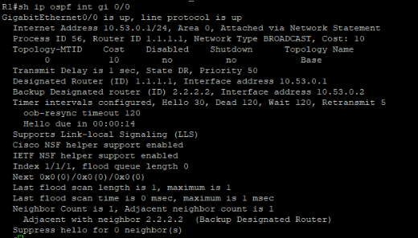

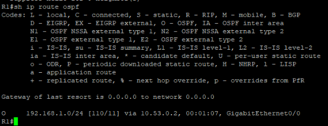

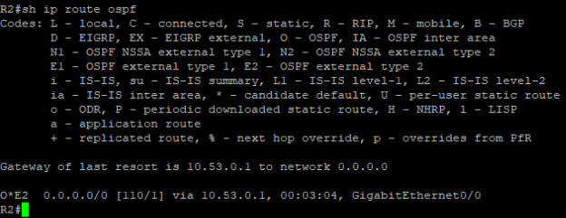

**Проверка связи:**

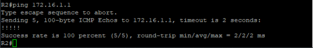

Ответ на вопрос:\
Метрика OSPF для маршрута по умолчанию отличается, потому что она рассчитывается на основе суммарной стоимости пути до шлюза по умолчанию, а не до конкретной сети.
