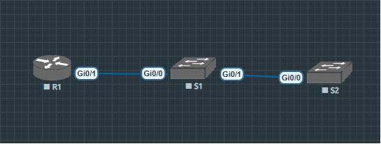
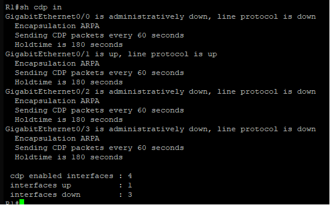
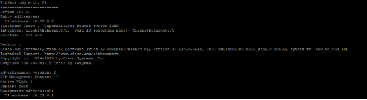
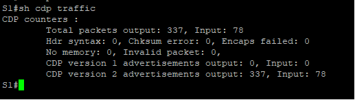
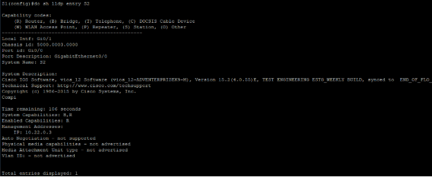
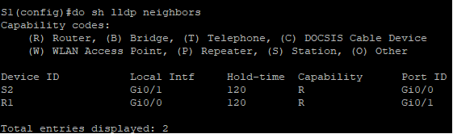
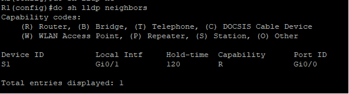
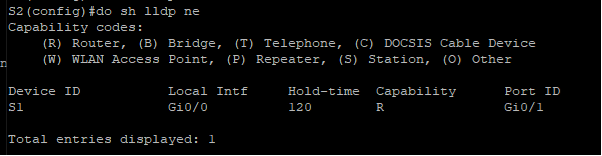
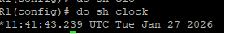

Задание 13 

Топология  

Таблица 

|**Устройство**|**Интерфейс**|**IP-адрес**|**Маска подсети**|**Шлюз по умолчанию**|
| :-: | :-: | :-: | :-: | :-: |
|R1|Loopback1|172\.16.1.1|255\.255.255.0|—|
|*R1*|G0/1|10\.22.0.1|255\.255.255.0|*—*|
|S1|SVI VLAN 1 |10\.22.0.2|255\.255.255.0|10\.22.0.1|
|S2|SVI VLAN 1|10\.22.0.3|255\.255.255.0|10\.22.0.1|

**Часть 1: Создание сети и настройка основных параметров устройства**

**Шаг 1: Настройка маршрутизатора R1**

Router> enable

Router# configure terminal

Router(config)# hostname R1

R1(config)# no ip domain lookup

R1(config)# enable secret class

R1(config)# service password-encryption

R1(config)# line console 0

R1(config-line)# password cisco

R1(config-line)# login

R1(config-line)# exit

R1(config)# line vty 0 15

R1(config-line)# password cisco

R1(config-line)# login

R1(config-line)# exit

R1(config)# banner motd # Unauthorized access is prohibited! #

R1(config)# interface loopback1

R1(config-if)# ip address 172.16.1.1 255.255.255.0

R1(config-if)# exit

R1(config)# interface g0/1

R1(config-if)# ip address 10.22.0.1 255.255.255.0

R1(config-if)# no shutdown

R1(config-if)# exit

R1(config)# end

R1# write memory

**Шаг 2: Настройка коммутаторов**

**На S1:**

Switch> enable

Switch# configure terminal

Switch(config)# hostname S1

S1(config)# no ip domain lookup

S1(config)# enable secret class

S1(config)# service password-encryption

S1(config)# line console 0

S1(config-line)# password cisco

S1(config-line)# login

S1(config-line)# exit

S1(config)# line vty 0 15

S1(config-line)# password cisco

S1(config-line)# login

S1(config-line)# exit

S1(config)# banner motd # Unauthorized access is prohibited! #

S1(config)# interface vlan 1

S1(config-if)# ip address 10.22.0.2 255.255.255.0

S1(config-if)# no shutdown

S1(config-if)# exit

S1(config)# ip default-gateway 10.22.0.1

S1(config)# interface range g0/2-3, g1/0-3

S1(config-if-range)# shutdown

S1(config-if-range)# exit

S1(config)# end

S1# write memory

**На S2:**

Switch> enable

Switch# configure terminal

Switch(config)# hostname S2

S2(config)# no ip domain lookup

S2(config)# enable secret class

S2(config)# service password-encryption

S2(config)# line console 0

S2(config-line)# password cisco

S2(config-line)# login

S2(config-line)# exit

S2(config)# line vty 0 15

S2(config-line)# password cisco

S2(config-line)# login

S2(config-line)# exit

S2(config)# banner motd # Unauthorized access is prohibited! #

S2(config)# interface vlan 1

S2(config-if)# ip address 10.22.0.3 255.255.255.0

S2(config-if)# no shutdown

S2(config-if)# exit

S2(config)# ip default-gateway 10.22.0.1

S2(config)# interface range g0/1-3, g1/0-3

S2(config-if-range)# shutdown

S2(config-if-range)# exit

S2(config)# end

S2# write memory

**Часть 2: Обнаружение сетевых ресурсов с помощью протокола CDP**

**Шаг 1: Проверка статуса CDP на R1**

**Ответ на вопрос:**\
**Сколько интерфейсов участвует в объявлениях CDP? Какие из них активны?**\
На R1 1 интерфейс (G0/1) участвует в объявлениях CDP, и он активен.

**Шаг 2: Получение информации о соседнем устройстве S1**

**Ответ на вопрос:**\
**Какая версия IOS используется на S1?**\
Версия IOS: Version 15.2(4.0.55)E

**Шаг 3: Проверка статистики CDP на S1**

**Ответ на вопрос:**\
**Сколько пакетов имеет выход CDP с момента последнего сброса счетчика?**

179 пакетов CDP отправлено с момента последнего сброса счетчика.

**Шаг 4: Отключение CDP**

R1(config)# no cdp run

S1(config)# no cdp run

S2(config)# no cdp run

**Часть 3: Обнаружение сетевых ресурсов с помощью протокола LLDP**

**Шаг 1: Включение LLDP на всех устройствах**

R1(config)# lldp run

S1(config)# lldp run

S2(config)# lldp run**

**Шаг 2: Получение информации о соседнем устройстве через LLDP**

**Ответ на вопрос:**\
**Что такое chassis ID для коммутатора S2?**\
Chassis ID: 5000.0003.0000

**Шаг 3: Отображение топологии сети через LLDP**

**Часть 4: Настройка и проверка NTP**

**Шаг 1: Проверка текущего времени на R1**

**Шаг 2: Настройка R1 в качестве NTP сервера**

R1(config)# ntp master 4

R1(config)# ntp source loopback1

**Шаг 3: Настройка S1 и S2 в качестве NTP клиентов**

S1# show ntp status

Clock is synchronized, stratum 5, reference is 10.22.0.1

nominal freq is 119.2092 Hz, actual freq is 119.2092 Hz, precision is 2\*\*18

reference time is E33D2C6F.8B7C28F9 (12:08:02.347 UTC Tue Jan 27 2026)

S1# show ntp associations

`  `address         ref clock       st   when   poll reach  delay  offset   disp

\*~10.22.0.1       172.16.1.1       4     10     64   377  1.000   0.000   1.168

` `\* sys.peer, # selected, + candidate, - outlyer, x falseticker, ~ configured

S1# show clock

12:10:02.347 UTC Tue Jan 27 2026

S2# show clock

12:15:25.154 UTC Tue Jan 27 2026

**Вопрос для повторения**

**Для каких интерфейсов в пределах сети не следует использовать протоколы обнаружения сетевых ресурсов? Поясните ответ.**

Протоколы обнаружения сетевых ресурсов (CDP и LLDP) не следует использовать на:

1. **Интерфейсах, подключенных к публичным сетям или Интернету** - это может раскрыть информацию о топологии сети и версиях ПО злоумышленникам
1. **Интерфейсах, подключенных к недоверенным сетям** - для предотвращения сбора информации о сетевой инфраструктуре
1. **Интерфейсах безопасности** (например, firewall interfaces) - для минимизации векторов атак
1. **Интерфейсах с критически важными устройствами** - где любая дополнительная информация может быть использована во вред

Эти протоколы следует отключать на граничных интерфейсах, но оставлять включенными во внутренней сети для облегчения управления и мониторинга.

