Задание 5

**Топология сети**

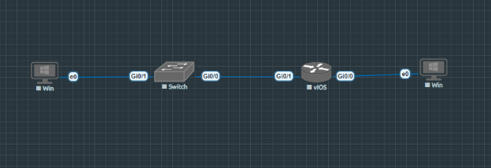

Рис.1 - Топология сети: маршрутизатор R1, коммутатор S1 и два ПК

**Соединения:**

- PC-A → S1/G0/1
- S1/G0/0 → R1/G0/1
- R1/G0/0 → PC-B

**Таблица адресации IPv6**

|**Устройство**|**Интерфейс**|**IPv6-адрес**|**Link local IPv6-адрес**|**Длина префикса**|**Шлюз по умолчанию**|
| :- | :- | :- | :- | :- | :- |
|**R1**|**G0/0/0**|**2001:db8:acad:a::1**|**fe80::1**|**64**|**—**|
|**R1**|**G0/0/1**|**2001:db8:acad:1::1** |**fe80::1**|**64**|**—**|
|**S1**|**VLAN 1**|**2001:db8:acad:1::b**|**fe80::b**|**64**|**—**|
|**PC-A**|**NIC**|**2001:db8:acad:1::3**|**SLACC**|**64**|**fe80::1**|
|**PC-B**|**NIC**|**2001:db8:acad:a::3**|**SLACC**|**64**|**fe80::1**|

**Часть 1: Настройка топологии и основных параметров устройств**

**Шаг 1: Настройка базовых параметров маршрутизатора R1**

Router> enable

Router# configure terminal

Router(config)# hostname R1

R1(config)# enable secret class

R1(config)# service password-encryption

R1(config)# line console 0

R1(config-line)# password cisco

R1(config-line)# login

R1(config-line)# exit

R1(config)# line vty 0 15

R1(config-line)# password cisco

R1(config-line)# login

R1(config-line)# exit

R1(config)# no ip domain-lookup

R1(config)# exit

R1# copy run star

**Шаг 2: Настройка базовых параметров коммутатора S1**

Switch> enable

Switch# configure terminal

Switch(config)# hostname S1

S1(config)# enable secret class

S1(config)# service password-encryption

S1(config)# line console 0

S1(config-line)# password cisco

S1(config-line)# login

S1(config-line)# exit

S1(config)# line vty 0 15

S1(config-line)# password cisco

S1(config-line)# login

S1(config-line)# exit

S1(config)# no ip domain-lookup

S1(config)# exit

S1# copy run star

**Часть 2: Ручная настройка IPv6-адресов**

**Шаг 1: Назначение IPv6-адресов интерфейсам Ethernet на R1**

**a.** Назначение глобальных IPv6-адресов

**Настройка интерфейса G0/0**:

R1# configure terminal

R1(config)# interface GigabitEthernet0/0

R1(config-if)# description Connection to PC-B

R1(config-if)# ipv6 address 2001:db8:acad:a::1/64

R1(config-if)# no shutdown

R1(config-if)# exit

**Настройка интерфейса G0/1:**

R1(config)# interface GigabitEthernet0/1

R1(config-if)# description Connection to S1

R1(config-if)# ipv6 address 2001:db8:acad:1::1/64

R1(config-if)# no shutdown

R1(config-if)# exit

**b.** Проверка назначенных IPv6-адресов

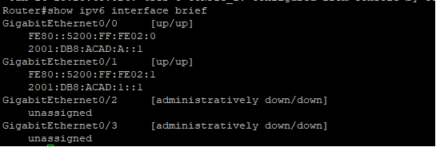

Рис.2 - Проверка IPv6-адресов на интерфейсах R1

**c.** Ручная настройка link-local адресов

R1(config)# interface GigabitEthernet0/0

R1(config-if)# ipv6 address fe80::1 link-local

R1(config-if)# exit

R1(config)# interface GigabitEthernet0/1

R1(config-if)# ipv6 address fe80::1 link-local

R1(config-if)# exit

**d. Проверка link-local адресов**

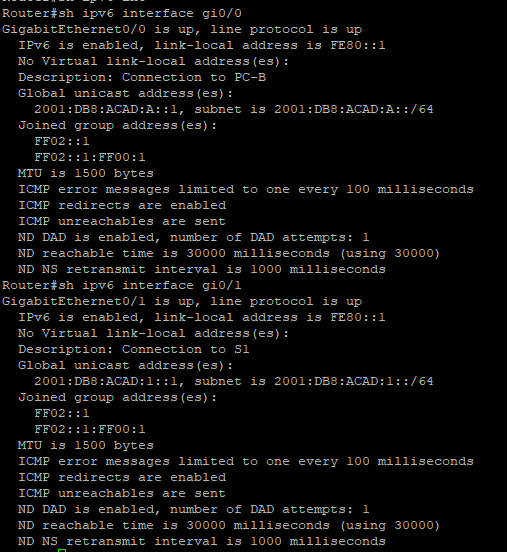

Рис.3 - Проверка link-local адресов на R1

**Ответ на вопрос:**\
Какие группы многоадресной рассылки назначены интерфейсу G0/0?\
После настройки интерфейс G0/0/0 должен иметь следующие multicast группы:

- FF02::1 (все узлы)
- FF02::2 (все маршрутизаторы)
- FF02::1:FF00:1 (solicited-node multicast)

**Шаг 2: Активация IPv6-маршрутизации на R1**

**a. Проверка PC-B до активации маршрутизации**

На PC-B проверяем текущую IPv6-конфигурацию:

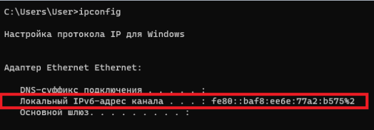

Рис.5 - IPv6-адреса PC-B до активации маршрутизации

**Ответ на вопрос:**\
**Назначен ли индивидуальный IPv6-адрес сетевой интерфейсной карте (NIC) на PC-B?**\
До активации маршрутизации на PC-B будет только link-local адрес (fe80::...), но не глобальный IPv6-адрес.

**b. Активация IPv6 маршрутизации на R1** 

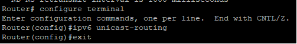

Рис.5 – Активация IPv6 маршрутизации

**c. Проверка PC-B после активации маршрутизации**

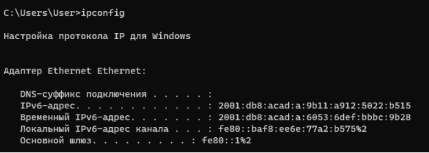

Рис.6 - IPv6-адреса PC-B после активации маршрутизации

**Ответ на вопрос:**\
**Почему PC-B получил глобальный префикс маршрутизации и идентификатор подсети, которые вы настроили на R1?**\
PC-B получил глобальный адрес через механизм SLAAC (Stateless Address Autoconfiguration). После активации ipv6 unicast-routing на R1, маршрутизатор начал отправлять Router Advertisement (RA) сообщения, содержащие префикс сети 2001:db8:acad:a::/64. PC-B использовал этот префикс для генерации своего глобального IPv6-адреса.

**Шаг 3: Назначение IPv6-адресов интерфейсу управления (SVI) на S1**

**a. Создание и настройка интерфейса VLAN 1**

S1# configure terminal

S1(config)# interface vlan 1

S1(config-if)# ipv6 address 2001:db8:acad:1::b/64

S1(config-if)# ipv6 address fe80::b link-local

S1(config-if)# no shutdown

S1(config-if)# end

S1# copy run st

**b. Проверка IPv6-адресов на S1**

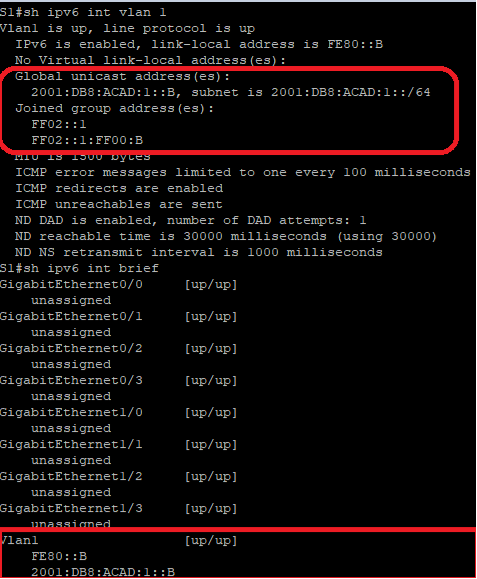

Рис.7 - Проверка IPv6-адресов на коммутаторе S1

**Шаг 4: Назначение статических IPv6-адресов компьютерам**

**a. Настройка PC-A**

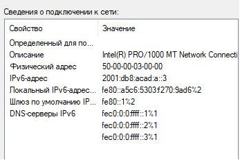

Рис.8 - Статическая настройка IPv6 на PC-A

**b. Настройка PC-B (SLAAC + статический)**

PC-B уже получил адрес через SLAAC, но для задания также настраиваем статически:

- IPv6 Address: 2001:db8:acad:a::3
- Prefix Length: 64
- Default Gateway: fe80::1

**Проверка обоих методов на PC-B:**

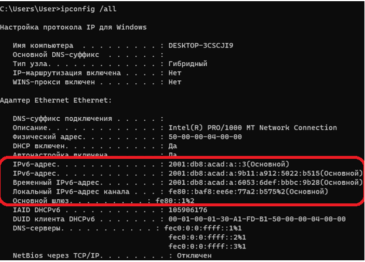

Рис.9 - PC-B с адресами SLAAC и статическим

**Часть 3: Проверка сквозного подключения**

**Шаг 1: Проверка связи с link-local адресом R1**

**С PC-A отправляем ping на fe80::1 (link-local адрес R1):**

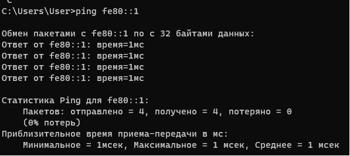

Рис.10 - Проверка связи с link-local адресом R1

**Шаг 2: Проверка связи с S1**

**С PC-A отправляем ping на S1:**

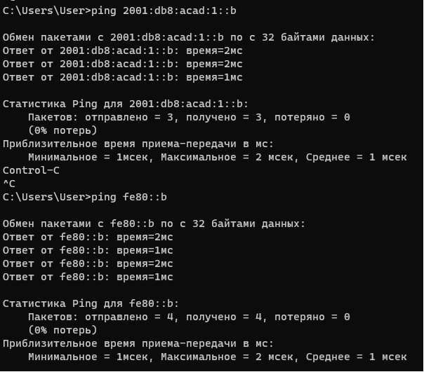

Рис.11 - Проверка связи с коммутатором S1

**Шаг 3: Проверка сквозного подключения к PC-B**

**Traceroute с PC-A на PC-B:**

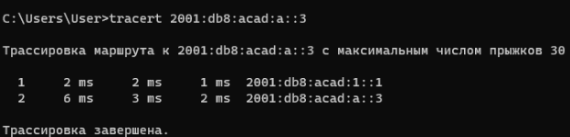

Рис.12 - Traceroute от PC-A к PC-B

**Шаг 4: Проверка связи с PC-A с PC-B**

**С PC-B отправляем ping на PC-A:**

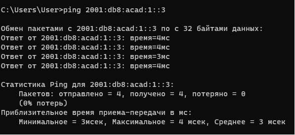

Рис.13 - Проверка связи между PC-B и PC-A

**Шаг 5: Проверка связи с link-local адресом R1 с PC-B**

**С PC-B отправляем ping на link-local адрес R1:**

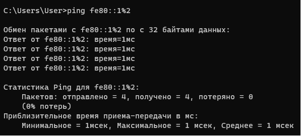

Рис.14 - Проверка связи с link-local адресом R1 с PC-B

**Проверка таблиц соседей (Neighbor Discovery)**

**Проверка на R1:**

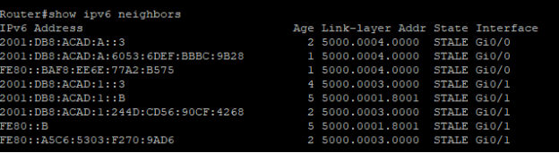

Рис.15 - Таблица IPv6 соседей на маршрутизаторе R1

**Проверка на S1:**

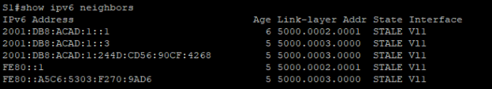

Рис.16 - Таблица IPv6 соседей на коммутаторе S1

**

**Итоговые конфигурации устройств**

**Конфигурация R1:**

R1# show running-config

! Фрагмент конфигурации IPv6

interface GigabitEthernet0/0

` `description Connection to PC-B

` `ipv6 address 2001:DB8:ACAD:A::1/64

` `ipv6 address FE80::1 link-local

` `no shutdown

!

interface GigabitEthernet0/1

` `description Connection to S1

` `ipv6 address 2001:DB8:ACAD:1::1/64

` `ipv6 address FE80::1 link-local

` `no shutdown

!

ipv6 unicast-routing

**Конфигурация S1:**

S1# show running-config

! Фрагмент конфигурации IPv6

interface Vlan1

` `ipv6 address 2001:DB8:ACAD:1::B/64

` `ipv6 address FE80::B link-local

` `no shutdown
**\

**Ответы на вопросы для повторения**

**1. Почему обоим интерфейсам Ethernet на R1 можно назначить один и тот же локальный адрес канала --- FE80::1?**

**Ответ:**\
Link-local адреса (fe80::/10) имеют **локальную область действия** и никогда не маршрутизируются за пределы локального сегмента сети (link). Каждый интерфейс маршрутизатора находится в отдельном broadcast-домене (разных VLAN/подсетях). Поэтому:

- fe80::1 на G0/0/0 используется только в сети с PC-B
- fe80::1 на G0/0/1 используется только в сети с S1 и PC-A

Эти адреса не конфликтуют, так как они существуют в разных изолированных сетевых сегментах.

**2. Какой идентификатор подсети в индивидуальном IPv6-адресе 2001:db8:acad::aaaa:1234/64?**

**Ответ:**\
Для адреса 2001:db8:acad::aaaa:1234/64:

- Префикс: 2001:db8:acad::/64
- Идентификатор подсети: 0000 (нули, так как в адресе после acad: идет ::, что означает нули)

Полный адрес с расширенными нулями: 2001:0db8:acad:0000:0000:0000:aaaa:1234\
Идентификатор подсети (третий хекстет): 0000

