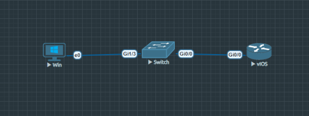
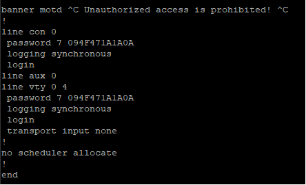
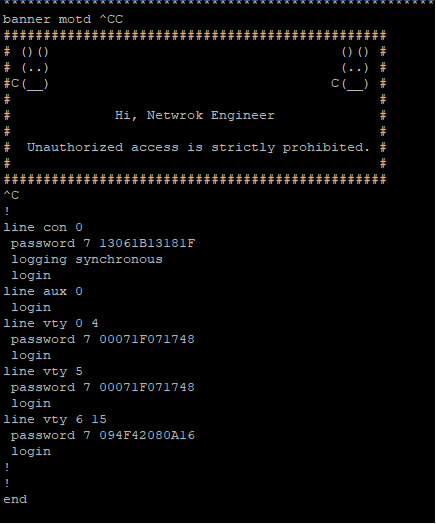
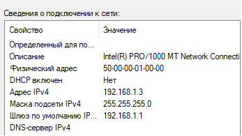
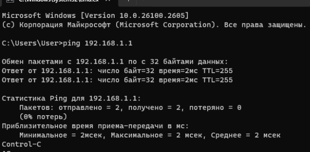
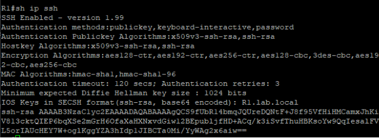
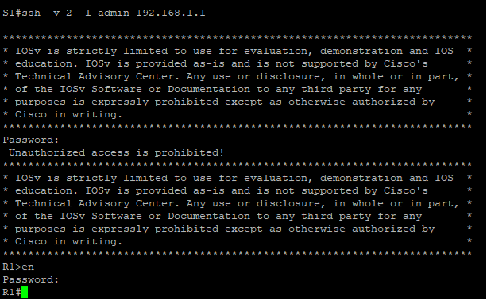
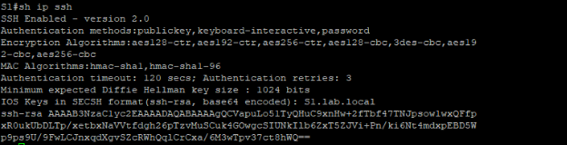
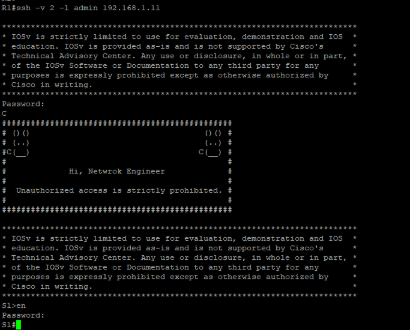

Задание 5

Рисунок 1: Топология сети в EVE-NG

**Описание подключений:**

- PC-A подключен к порту G1/3 коммутатора S1
- S1 порт G0/0 подключен к порту G0/0 маршрутизатора R1

**Часть 1: Настройка топологии и основных параметров устройств**

**Шаг 1: Создание топологии в EVE-NG**

В EVE-NG создана топология с использованием:

- R1 - маршрутизатор Cisco IOL L3
- S1 - коммутатор Cisco IOL L2
- PC-A - виртуальный ПК с Windows 1

**Таблица адресации**

|**Устройство**|**Интерфейс**|**IP-адрес**|**Маска подсети**|**Шлюз по умолчанию**|
| :-: | :-: | :-: | :-: | :-: |
|R1|G0/0|192\.168.1.1|255\.255.255.0|—|
|S1|VLAN 1|192\.168.1.11|255\.255.255.0|192\.168.1.1|
|PC-A|NIC|192\.168.1.3|255\.255.255.0|192\.168.1.1|

**

**Часть 1: Настройка топологии и основных параметров устройств**

**Шаг 1: Создание топологии в EVE-NG**

В EVE-NG создана топология с использованием:

- R1 - маршрутизатор Cisco IOL L3
- S1 - коммутатор Cisco IOL L2
- PC-A - виртуальный ПК с Windows 11

**Шаг 2: Настройка базовых параметров маршрутизатора R1**

Router> enable

Router# configure terminal

Router(config)# hostname R1

R1(config)# enable secret class

R1(config)# service password-encryption

R1(config)# line console 0

R1(config-line)# password cisco

R1(config-line)# login

R1(config-line)# exit

R1(config)# line vty 0 4

R1(config-line)# password cisco

R1(config-line)# login

R1(config-line)# exit

R1(config)# no ip domain-lookup

R1(config)# banner motd # Unauthorized access is prohibited! #

R1(config)# exit

R1# copy run st

**Шаг 3: Настройка IP-адреса на интерфейсе R1**

R1# configure terminal

R1(config)# interface GigabitEthernet0/0/1

R1(config-if)# description Connection to S1

R1(config-if)# ip address 192.168.1.1 255.255.255.0

R1(config-if)# no shutdown

R1(config-if)# exit

R1(config)# exit

R1# copy run st

Рис.2 - Базовая настройка маршрутизатора R1

**Шаг 5: Настройка IP-адреса на S1**

S1# configure terminal

S1(config)# interface Vlan1

S1(config-if)# ip address 192.168.1.11 255.255.255.0

S1(config-if)# no shutdown

S1(config-if)# exit

S1(config)# ip default-gateway 192.168.1.1

S1(config)# exit

S1# copy run st

Рис.3 - Базовая настройка коммутатора S1

**Шаг 6: Настройка PC-A**

Рис.4 – Cетевые настройки PC-A

**Шаг 7: Проверка базового подключения**

Рис.5 - Проверка связи между PC-A и R1

**Часть 2: Настройка SSH на маршрутизаторе R1**

**Шаг 1: Подготовка к настройке SSH**

R1# configure terminal

R1(config)# ip domain-name lab.local

**Шаг 2: Генерация RSA ключей**

R1(config)#crypto key gen rsa

% You already have RSA keys defined named R1.lab.local.

% Do you really want to replace them? [yes/no]: y

Choose the size of the key modulus in the range of 360 to 4096 for your

`  `General Purpose Keys. Choosing a key modulus greater than 512 may take

`  `a few minutes.

How many bits in the modulus [512]: 10

\*Jan 15 19:26:11.086: %SSH-5-DISABLED: SSH 1.5 has been disabled

1024

% Generating 1024 bit RSA keys, keys will be non-exportable...

[OK] (elapsed time was 1 seconds)

**Шаг 3: Создание пользователя SSH**

R1(config)# username admin secret

**Шаг 4: Настройка линий VTY для SSH**

R1(config)# line vty 0 4

R1(config-line)# transport input ssh telnet

R1(config-line)# login local

R1(config-line)# exit

R1(config)# exit

R1# copy run st

**Шаг 5: Проверка конфигурации SSH**

Рис.6 - Статус SSH на маршрутизаторе R1
**\

**Шаг 6: Подключение по SSH с S1**

Рис.8 – Подключение с S1 на R1

**Часть 3: Настройка SSH на коммутаторе S1**

**Шаг 1: Подготовка к настройке SSH**

S1# configure terminal

S1(config)# ip domain-name lab.local

**Шаг 2: Генерация RSA ключей**

S1(config)# crypto key generate rsa

The name for the keys will be: S1.lab.local

Choose the size of the key modulus in the range of 360 to 4096 for your

`  `General Purpose Keys. Choosing a key modulus greater than 512 may take

`  `a few minutes.

How many bits in the modulus [512]: 1024

% Generating 1024 bit RSA keys, keys will be non-exportable...

[OK] (elapsed time was 2 seconds)

**Шаг 3: Создание пользователя SSH**

S1(config)# username admin secret cisco

**Шаг 4: Настройка линий VTY для SSH**

S1(config)# line vty 0 15

S1(config-line)# transport input ssh 

S1(config-line)# login local

S1(config-line)# end

S1# copy run st

**Шаг 5: Проверка конфигурации SSH**

Рис.9 - Статус SSH на коммутаторе S1

**Шаг 6: Подключение по SSH к S1 с R1**

Рис.10 - Подключение с R1 на S1

**

**Вопрос:** Удалось ли установить SSH-соединение с коммутатором?

**Ответ:** Да, SSH-соединение установлено успешно. При подключении отображается баннер и появляется приглашение к

