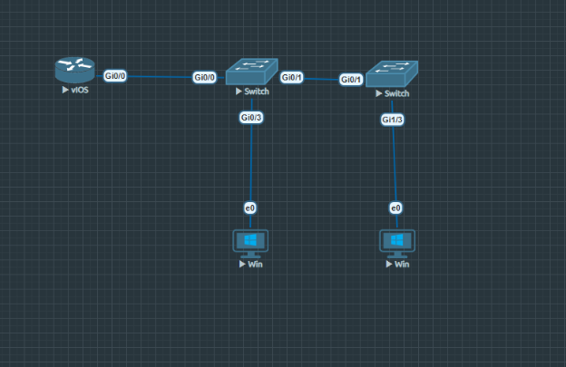
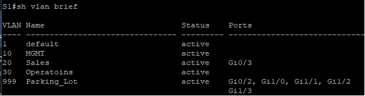
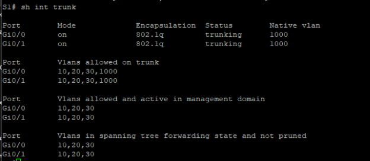
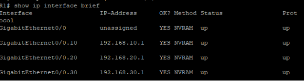
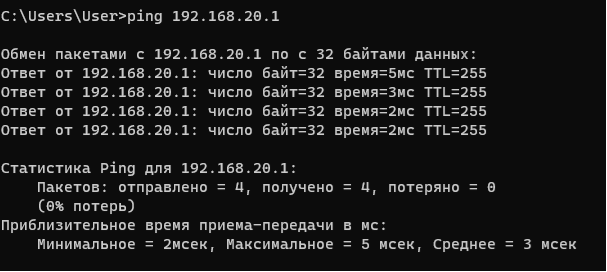
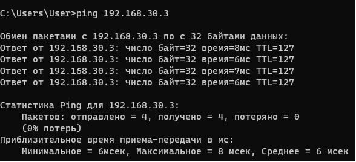
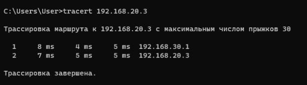

Задание 6

**Таблица адресации**

|**Устройство**|**Интерфейс**|**IP-адрес**|**Маска подсети**|**Шлюз по умолчанию**|
| :- | :- | :- | :- | :- |
|R1|G0/1.10|192\.168.10.1|255\.255.255.0|—|
|*R1*|G0/1.20|192\.168.20.1|255\.255.255.0|*—*|
|*R1*|G0/1.30|192\.168.30.1|255\.255.255.0|*—*|
|*R1*|G0/1.1000|—|—|*—*|
|S1|VLAN 10|192\.168.10.11|255\.255.255.0|192\.168.10.1|
|S2|VLAN 10|192\.168.10.12|255\.255.255.0|192\.168.10.1|
|PC-A|NIC|192\.168.20.3|255\.255.255.0|192\.168.20.1|
|PC-B|NIC|192\.168.30.3|255\.255.255.0|192\.168.30.1|

**Таблица VLAN**

|**VLAN**|**Имя**|**Назначенный интерфейс**|
| :- | :- | :- |
|10|Управление|
S1: VLAN 10 

S2: VLAN 10 
|
|20|Sales|S1: G0/3|
|30|Operations|S2: G1/3|
|999|Parking\_Lot|
С1: G0/2, G1/-2 

С2: G0/2-3,G1/0-2
|

**Часть 1: Настройка топологии и основных параметров устройств.**

**Шаг 1: Создание топологии в EVE-NG**

**В EVE-NG создана топология с использованием:**

- R1 - маршрутизатор Cisco IOL L3
- S1, S2 - коммутаторы Cisco IOL L2
- PC-A, PC-B - виртуальные ПК

**Шаг 2: Настройка базовых параметров маршрутизатора R1**

Router> enable

Router# configure terminal

Router(config)# hostname R1

R1(config)# enable secret class

R1(config)# service password-encryption

R1(config)# line console 0

R1(config-line)# password cisco

R1(config-line)# login

R1(config-line)# exit

R1(config)# line vty 0 15

R1(config-line)# password cisco

R1(config-line)# login

R1(config-line)# exit

R1(config)# no ip domain-lookup

R1(config)# banner motd # Unauthorized access is prohibited! #

R1(config)# clock timezone MSK 3

R1(config)# exit

R1# copy run st

**Шаг 3: Настройка базовых параметров коммутатора S1**

Switch> enable

Switch# configure terminal

Switch(config)# hostname S1

S1(config)# enable secret class

S1(config)# service password-encryption

S1(config)# line console 0

S1(config-line)# password cisco

S1(config-line)# login

S1(config-line)# exit

S1(config)# line vty 0 15

S1(config-line)# password cisco

S1(config-line)# login

S1(config-line)# exit

S1(config)# no ip domain-lookup

S1(config)# banner motd # Unauthorized access is prohibited! #

S1(config)# clock timezone MSK 3

S1(config)# exit

S1# copy run st

**Шаг 4: Настройка базовых параметров коммутатора S2**

Switch> enable

Switch# configure terminal

Switch(config)# hostname S2

S2(config)# enable secret class

S2(config)# service password-encryption

S2(config)# line console 0

S2(config-line)# password cisco

S2(config-line)# login

S2(config-line)# exit

S2(config)# line vty 0 15

S2(config-line)# password cisco

S2(config-line)# login

S2(config-line)# exit

S2(config)# no ip domain-lookup

S2(config)# banner motd # Unauthorized access is prohibited! #

S2(config)# clock timezone MSK 3

S2(config)# exit

S2# copy run st

**Шаг 5: Настройка узлов ПК**

- PC-A: IP 192.168.20.3/24, Gateway 192.168.20.1
- PC-B: IP 192.168.30.3/24, Gateway 192.168.30.1

**Часть 2: Создание VLAN и назначение портов**

**Шаг 1: Создание VLAN на коммутаторах**

**На S1:**

S1# configure terminal

S1(config)# vlan 10

S1(config-vlan)# name Management

S1(config-vlan)# exit

S1(config)# vlan 20

S1(config-vlan)# name Sales

S1(config-vlan)# exit

S1(config)# vlan 30

S1(config-vlan)# name Operations

S1(config-vlan)# exit

S1(config)# vlan 999

S1(config-vlan)# name Parking\_Lot

S1(config-vlan)# exit

S1(config)# vlan 1000

S1(config-vlan)# name Native

S1(config-vlan)# exit

**На S2:**

S2# configure terminal

S2(config)# vlan 10

S2(config-vlan)# name Management

S2(config-vlan)# exit

S2(config)# vlan 20

S2(config-vlan)# name Sales

S2(config-vlan)# exit

S2(config)# vlan 30

S2(config-vlan)# name Operations

S2(config-vlan)# exit

S2(config)# vlan 999

S2(config-vlan)# name Parking\_Lot

S2(config-vlan)# exit

S2(config)# vlan 1000

S2(config-vlan)# name Native

S2(config-vlan)# exit

**Шаг 2: Настройка интерфейса управления на коммутаторах**

**На S1:**

S1(config)# interface vlan 10

S1(config-if)# description Management Interface

S1(config-if)# ip address 192.168.10.11 255.255.255.0

S1(config-if)# no shutdown

S1(config-if)# exit

S1(config)# ip default-gateway 192.168.10.1

**На S2:**

S2(config)# interface vlan 10

S2(config-if)# description Management Interface

S2(config-if)# ip address 192.168.10.12 255.255.255.0

S2(config-if)# no shutdown

S2(config-if)# exit

S2(config)# ip default-gateway 192.168.10.1

**Шаг 3: Настройка неиспользуемых портов в VLAN Parking\_Lot**

**На S1 (порты G0/2, G1/0-2):**

S1(config)# interface range g0/2, g1/0-2

S1(config-if-range)# switchport mode access

S1(config-if-range)# switchport access vlan 999

S1(config-if-range)# shutdown

S1(config-if-range)# description Unused Port - Parking\_Lot

S1(config-if-range)# exit

**На S2 (порты G0/2-3, G1/0-2):**

S2(config)# interface range g0/2-3, g1/0-2

S2(config-if-range)# switchport mode access

S2(config-if-range)# switchport access vlan 999

S2(config-if-range)# shutdown

S2(config-if-range)# description Unused Port - Parking\_Lot

S2(config-if-range)# exit

**Шаг 4: Назначение портов доступа соответствующим VLAN**

**На S1 (порт G0/3 для PC-A в VLAN 20):**

S1(config)# interface g0/3

S1(config-if)# description PC-A Connection (VLAN 20 - Sales)

S1(config-if)# switchport mode access

S1(config-if)# switchport access vlan 20

S1(config-if)# no shutdown

S1(config-if)# exit

**На S2 (порт G1/3 для PC-B в VLAN 30):**

S2(config)# interface g1/3

S2(config-if)# description PC-B Connection (VLAN 30 - Operations)

S2(config-if)# switchport mode access

S2(config-if)# switchport access vlan 30

S2(config-if)# no shutdown

S2(config-if)# exit

**Шаг 5: Проверка VLAN конфигурации на S1**

Рис.2 - Проверка VLAN конфигурации на S1

**Часть 3: Настройка транков 802.1Q между коммутаторами (порты G0)**

**Шаг 1: Настройка транка между S1 и S2 (G0/1 на S1 ↔ G0/1 на S2)**

**На S1** (порт G0/1 как транк к S2):

S1(config)# interface g0/1

S1(config-if)# description Trunk to S2 (G0/1)

S1(config-if)# switchport mode trunk

S1(config-if)# switchport trunk native vlan 1000

S1(config-if)# switchport trunk allowed vlan 10,20,30,1000

S1(config-if)# no shutdown

S1(config-if)# exit
**\

**На S2 (порт G0/1 как транк к S1):**

S2(config)# interface g0/1

S2(config-if)# description Trunk to S1 (G0/1)

S2(config-if)# switchport mode trunk

S2(config-if)# switchport trunk native vlan 1000

S2(config-if)# switchport trunk allowed vlan 10,20,30,1000

S2(config-if)# no shutdown

S2(config-if)# exit

**Шаг 2: Настройка транка между S1 и R1 (G0/0 на S1)**

S1(config)# interface g0/0

S1(config-if)# description Trunk to R1 (G0/0/1)

S1(config-if)# switchport mode trunk

S1(config-if)# switchport trunk native vlan 1000

S1(config-if)# switchport trunk allowed vlan 10,20,30,1000

S1(config-if)# no shutdown

S1(config-if)# exit

S1(config)# exit

S1# write memory

**Шаг 3: Проверка транковых соединений на S1**

Рис.3 - Проверка транковых соединений на S1

**Часть 4: Настройка маршрутизации между VLAN на R1**

**Шаг 1: Активация физического интерфейса на R1**

R1# configure terminal

R1(config)# interface g0/0/1

R1(config-if)# description Trunk to S1 (G0/0)

R1(config-if)# no shutdown

R1(config-if)# exit

**Шаг 2: Настройка сабинтерфейсов для каждой VLAN**

**Сабинтерфейс для VLAN 10 (Management):**

R1(config)# interface g0/0/1.10

R1(config-subif)# description VLAN 10 - Management

R1(config-subif)# encapsulation dot1Q 10

R1(config-subif)# ip address 192.168.10.1 255.255.255.0

R1(config-subif)# exit

**Сабинтерфейс для VLAN 20 (Sales):**

R1(config)# interface g0/0/1.20

R1(config-subif)# description VLAN 20 - Sales

R1(config-subif)# encapsulation dot1Q 20

R1(config-subif)# ip address 192.168.20.1 255.255.255.0

R1(config-subif)# exit

**Сабинтерфейс для VLAN 30 (Operations):**

R1(config)# interface g0/0/1.30

R1(config-subif)# description VLAN 30 - Operations

R1(config-subif)# encapsulation dot1Q 30

R1(config-subif)# ip address 192.168.30.1 255.255.255.0

R1(config-subif)# exit

**Сабинтерфейс для Native VLAN 1000:**

R1(config)# interface g0/0/1.1000

R1(config-subif)# description Native VLAN 1000

R1(config-subif)# encapsulation dot1Q 1000 native

R1(config-subif)# exit

**Шаг 3: Проверка сабинтерфейсов**

**Часть 5: Проверка работы маршрутизации между VLAN**

**Тест 1: Проверка связи PC-A со своим шлюзом**

**Тест 2: Проверка связи PC-A с PC-B (между VLAN)**

**Тест 3: Tracert с PC-B на PC-A**

**Ответ на вопрос:** Промежуточный IP-адрес - 192.168.30.1 (шлюз по умолчанию для PC-B, сабинтерфейс R1 для VLAN 30).

