Задание 7

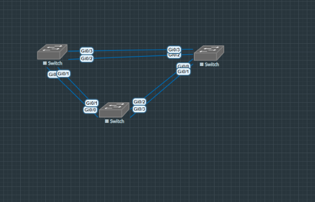

- Все коммутаторы соединены между собой для обеспечения избыточности.
- Используются порты G0/0, G0/1, G0/2, G0/3.

**Таблица адресации:**

|
Устройство

|Интерфейс|IP-адрес|Маска подсети|
| :- | :- | :- | :- |
|S1|VLAN 1|192\.168.1.1|255\.255.255.0|
|S2|VLAN 1|192\.168.1.2|255\.255.255.0|
|S3|VLAN 1|192\.168.1.3|255\.255.255.0|

**Часть 1: Создание сети и настройка основных параметров устройства**

**Шаг 1: Создание топологии в EVE-NG**

В EVE-NG создана топология с использованием трех коммутаторов Cisco IOL L2:

- S1, S2, S3 — коммутаторы Cisco IOL L2.
- Соединения:
  - S1 G0/0 ↔ S2 G0/0
  - S1 G0/3 ↔ S3 G0/3
  - S2 G0/2 ↔ S3 G0/2
  - S1 G0/2 ↔ S3 G0/1
  - S2 G0/3 ↔ S3 G0/0

**Шаг 2: Настройка базовых параметров коммутаторов**

**Настройка коммутатора S1:**

Switch> enable

Switch# configure terminal

Switch(config)# hostname S1

S1(config)# enable secret class

S1(config)# no ip domain-lookup

S1(config)# line console 0

S1(config-line)# password cisco

S1(config-line)# login

S1(config-line)# logging synchronous

S1(config-line)# exit

S1(config)# line vty 0 15

S1(config-line)# password cisco

S1(config-line)# login

S1(config-line)# exit

S1(config)# banner motd #Unauthorized access is prohibited#

S1(config)# interface vlan 1

S1(config-if)# ip address 192.168.1.1 255.255.255.0

S1(config-if)# no shutdown

S1(config-if)# exit

S1(config)# exit

S1# copy running-config startup-config

**Настройка коммутатора S2 (аналогично):**

hostname S2

interface vlan 1

` `ip address 192.168.1.2 255.255.255.0

**Настройка коммутатора S3 (аналогично):**

hostname S3

interface vlan 1

` `ip address 192.168.1.3 255.255.255.0

**Шаг 3: Проверка связности**

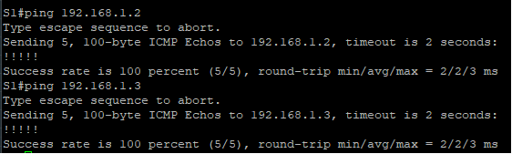

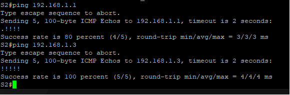

**Ответы:**

- Успешно ли выполняется эхо-запрос от S1 на S2? **Да**
- Успешно ли выполняется эхо-запрос от S1 на S3? **Да**
- Успешно ли выполняется эхо-запрос от S2 на S3? **Да**

**Часть 2: Определение корневого моста**

**Шаг 1: Настройка транковых портов**

S1(config)# interface range G0/0-3

S1(config-if-range)# switchport mode trunk

S1(config-if-range)# no shutdown

(аналогично на S2 и S3)

**Шаг 2: Просмотр состояния STP**

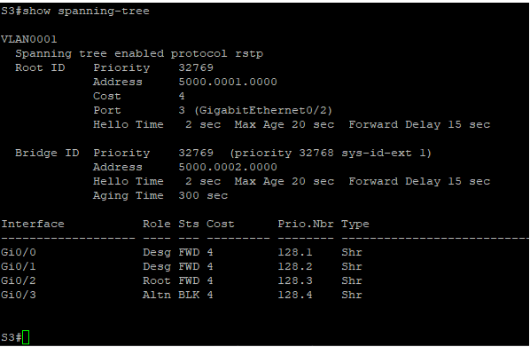

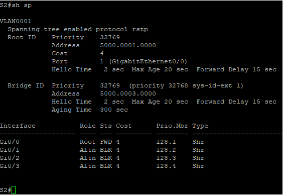

**Заполнение таблицы:**

- **S1 G0/1** Desg FWD
- **S1 G0/3**: Desg FWD 
- **S3 G0/1**: Desg FWD 
- **S3 G0/3**: Altn BLK

**Ответы на вопросы:**

1. **Какой коммутатор является корневым мостом?** S1
1. **Почему этот коммутатор выбран?** Потому что он имеет наименьший Bridge ID (BID). BID состоит из приоритета (32768) и MAC-адреса (5000.0001.0000). MAC-адрес S1 (5000.0001.0000) является наименьшим среди всех трех коммутаторов (S2: 5000.0003.0000, S3: 5000.0002.0000).
1. **Какие порты являются корневыми?** S2 G0/0, S3 G0/2.
1. **Какие порты являются назначенными?** S1 G0/0, G0/1, G0/2, G0/3; S3 G0/0,G0/1
1. **Какой порт заблокирован?** S2 G0/1, G0/2,G0/3; S3 G0/3
1. **Почему выбран этот порт?**  Протокол STP выбирает **один лучший путь** к корневому мосту и блокирует все остальные избыточные пути для предотвращения петель. На S2 порт G0/0 выбран как корневой (лучший путь к S1), поэтому порты G0/1, G0/2, G0/3 блокируются как альтернативные. На S3 порт G0/2 выбран как корневой, поэтому порт G0/3 блокируется как альтернативный. Выбор основывается на **стоимости пути** (Cost), которая на всех портах равна 4, а затем на **приоритете порта** (Prio.Nbr), где выбирается порт с меньшим номером.

**Часть 3: Наблюдение за выбором порта на основе стоимости**

**Шаг 1: Определение заблокированного порта**

Исходя из предоставленных скриншотов, на коммутаторах некорневого моста имеются следующие заблокированные порты:

**На S2:**

- GigabitEthernet0/1: Altn BLK
- GigabitEthernet0/2: Altn BLK
- GigabitEthernet0/3: Altn BLK

**На S3:**

- GigabitEthernet0/3: Altn BLK

Для демонстрации выбора порта на основе стоимости выберем один из заблокированных портов на S2, например **GigabitEthernet0/1**, и попытаемся сделать его активным путем изменения стоимости корневого порта.

**Шаг 2: Изменение стоимости порта**

На S2 корневым портом является GigabitEthernet0/0 (стоимость 4, приоритет 128.1). Чтобы разблокировать порт GigabitEthernet0/1, нужно сделать стоимость через него до корневого моста меньше, чем через GigabitEthernet0/0.

**Выполним на коммутаторе S2:**

S2# configure terminal

S2(config)# interface GigabitEthernet0/0

S2(config-if)# spanning-tree vlan 1 cost 10

S2(config-if)# end
**\

**Шаг 3: Проверка изменений**

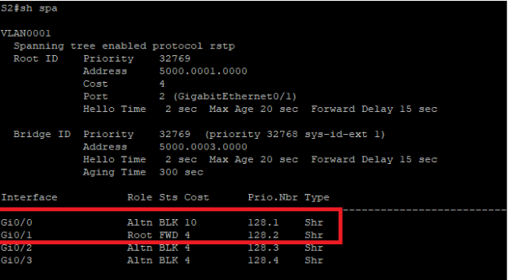

**На S3 проверим, не изменилась ли топология:**

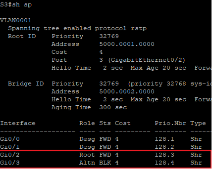

Топология осталось прежней  , это подтверждает факт того что изменение стоимости порта влияет только на локальный выбор пути 

**Ответ на вопрос:** Почему протокол spanning-tree заменяет ранее заблокированный порт на корневой порт?

**Ответ:** Алгоритм STP всегда выбирает путь с **наименьшей совокупной стоимостью** до корневого моста. Увеличив стоимость порта G0/0, мы сделали путь через G0/1 более предпочтительным (стоимость 4 < 10). STP автоматически пересчитывает оптимальный путь и:

1. Меняет роль порта G0/1 с Alternate на Root
1. Блокирует порт G0/0 как Alternate
1. Это демонстрирует динамическую адаптацию STP к изменениям в сети

**Шаг 4: Возврат настроек**

Вернем исходную конфигурацию стоимости порта:

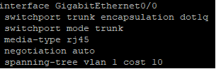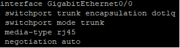

` 		`Было							Стало					

**Проверка восстановления:**

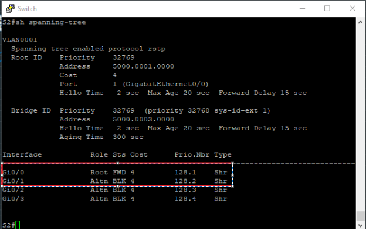

**Часть 4: Наблюдение за выбором порта на основе приоритета**

**Шаг 1: Анализ текущего выбора портов на основе приоритета**

**На S2:**

- Все 4 порта имеют одинаковую стоимость (4)
- STP выбрал G0/0 как корневой порт (приоритет 128.1)
- Остальные порты заблокированы (G0/1: 128.2, G0/2: 128.3, G0/3: 128.4)

**На S3:**

- Порты G0/2 и G0/3 имеют одинаковую стоимость (4)
- STP выбрал G0/2 как корневой порт (приоритет 128.3)
- Порт G0/3 заблокирован (приоритет 128.4)

**Шаг 2: Демонстрация влияния приоритета порта**

Чтобы показать, как приоритет влияет на выбор порта при равной стоимости, изменим приоритет порта G0/3 на S3:

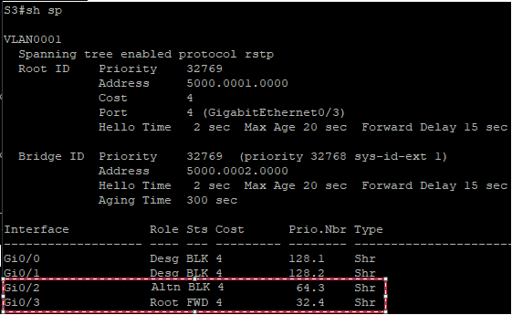

**Ответы на вопросы:**

1. **Какой порт выбран протоколом STP в качестве порта корневого моста на каждом коммутаторе некорневого моста?**
   1. На **S2**: GigabitEthernet0/0
   1. На **S3**: GigabitEthernet0/2 (до изменения), после изменения - GigabitEthernet0/3
1. **Почему протокол STP выбрал эти порты в качестве портов корневого моста на этих коммутаторах?**
   1. При равной стоимости всех путей (4) STP использует **приоритет порта** как следующий критерий
   1. Выбирается порт с **наименьшим значением приоритета**
   1. На S2: G0/0 (128.1) имеет наименьший приоритет среди всех портов
   1. На S3: изначально G0/2 (128.3) имеет меньший приоритет, чем G0/3 (128.4)

**Шаг 4: Возврат к исходным настройкам**

S3# configure terminal

S3(config)# interface GigabitEthernet0/3

S3(config-if)# no spanning-tree vlan 1 port-priority

S3(config-if)# end

**Вопросы для повторения:**

**1. Какое значение протокол STP использует первым после выбора корневого моста, чтобы определить выбор порта?\
Ответ: Стоимость пути (Path Cost) до корневого моста. Протокол выбирает порт с наименьшей совокупной стоимостью пути до корневого моста. В представленной топологии все порты имеют стоимость 4, поэтому следующий критерий становится решающим.**

**2. Если первое значение на двух портах одинаково, какое следующее значение будет использовать протокол STP при выборе порта?\
Ответ: Bridge ID соседнего коммутатора (Sender Bridge ID). Если стоимости равны, STP сравнивает BID коммутатора на другом конце линка. Однако в данной топологии все порты подключены к одному коммутатору (S1 - корневой мост), поэтому этот критерий не различает порты.**

**3. Если оба значения на двух портах равны, каким будет следующее значение, которое использует протокол STP при выборе порта?\
Ответ: Приоритет порта (Port Priority). Когда стоимости и BID равны, STP использует приоритет порта как решающий критерий. Приоритет порта состоит из базового значения (по умолчанию 128) и номера порта. Выбирается порт с наименьшим значением приоритета.**

