Задание 8

**Топология сети:**

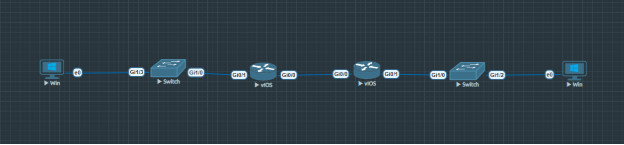

Рисунок 1 – топология сети 

**Часть 1: Настройка DHCPv4**

**Шаг 1: Создание схемы адресации**

**Исходная сеть:** 192.168.1.0/24

**Подсеть A (58 хостов)**

- Подсеть: 192.168.1.0/26 (маска 255.255.255.192)
- Диапазон адресов: 192.168.1.1 - 192.168.1.62
- Broadcast: 192.168.1.63
- Первый полезный адрес для R1 G0/0/1.100: **192.168.1.1**

**Подсеть B (28 хостов)**

- Подсеть: 192.168.1.64/27 (маска 255.255.255.224)
- Диапазон адресов: 192.168.1.65 - 192.168.1.94
- Broadcast: 192.168.1.95
- Первый полезный адрес для R1 G0/0/1.200: **192.168.1.65**
- Второй адрес для S1 VLAN 200: **192.168.1.66**
- Шлюз по умолчанию для S1: **192.168.1.65**

**Подсеть C (12 хостов)**

- Подсеть: 192.168.1.96/28 (маска 255.255.255.240)
- Диапазон адресов: 192.168.1.97 - 192.168.1.110
- Broadcast: 192.168.1.111
- Первый полезный адрес для R2 G0/0/1: **192.168.1.97**

**Шаг 2: Базовая настройка маршрутизаторов**

**Настройка R1:**

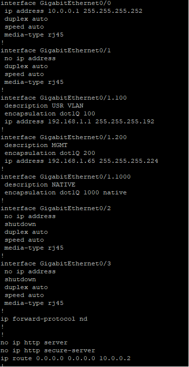

Рисунок 2 – Базовая конфигурация R1

**Настройка R2:**

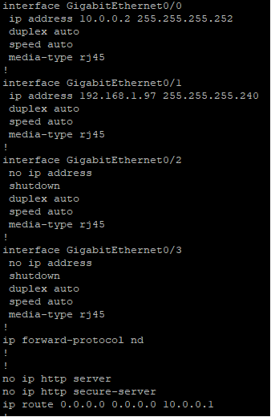

Рисунок 3 – Базовая конфигурация R2

**

**Шаг 3: Настройка коммутаторов**

**Настройка Switch1 (для PC-A):**

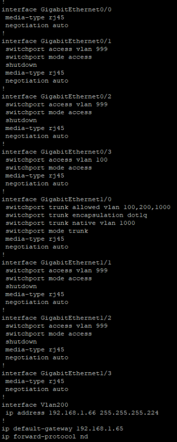

Рисунок 4 – настройки SW1

**Настройка Switch2 (для PC-B):**

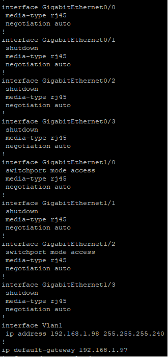

Рисунок 5 – Настройка SW2

**Шаг 4: Настройка пулов DHCPv4 на R1**

**Пул для подсети A (VLAN 100):**

R1# configure terminal

R1(config)# ip dhcp excluded-address 192.168.1.1 192.168.1.5

R1(config)# ip dhcp pool R1\_Client\_LAN

R1(dhcp-config)# network 192.168.1.0 255.255.255.192

R1(dhcp-config)# domain-name CCNA-lab.com

R1(dhcp-config)# default-router 192.168.1.1

R1(dhcp-config)# lease 2 12 30

R1(dhcp-config)# exit

**Пул для подсети C (через R2):**

R1(config)# ip dhcp excluded-address 192.168.1.97 192.168.1.101

R1(config)# ip dhcp pool R2\_Client\_LAN

R1(dhcp-config)# network 192.168.1.96 255.255.255.240

R1(dhcp-config)# domain-name CCNA-lab.com

R1(dhcp-config)# default-router 192.168.1.97

R1(dhcp-config)# lease 2 12 30

R1(dhcp-config)# exit

R1(config)# exit

R1# copy running-config startup-config

**Шаг 5: Настройка DHCP-ретрансляции на R2**

R2# configure terminal

R2(config)# interface GigabitEthernet0/1

R2(config-if)# ip helper-address 10.0.0.1

R2(config-if)# exit

R2(config)# exit

R2# copy running-config startup-config

**Шаг 6: Проверка DHCPv4**

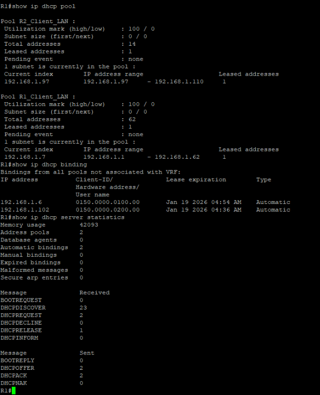

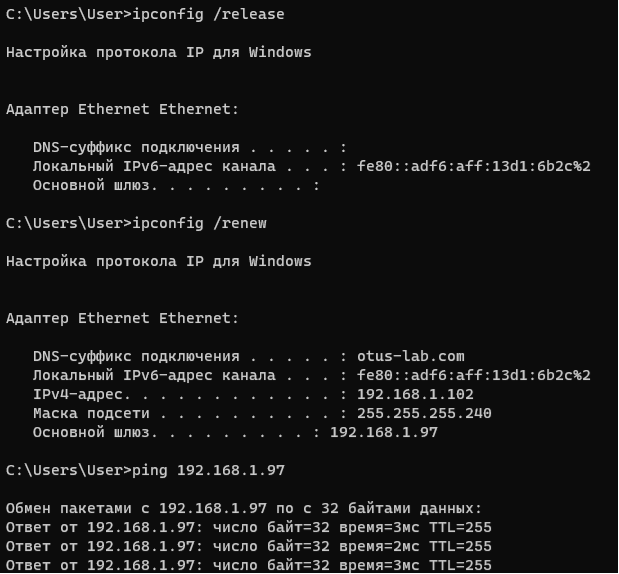

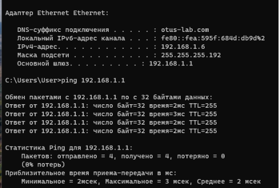

**Часть 2: Настройка DHCPv6**

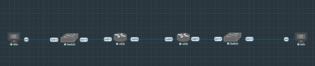

**Шаг 1: Базовая настройка IPv6 на маршрутизаторах**

**Конфигурация R1:**

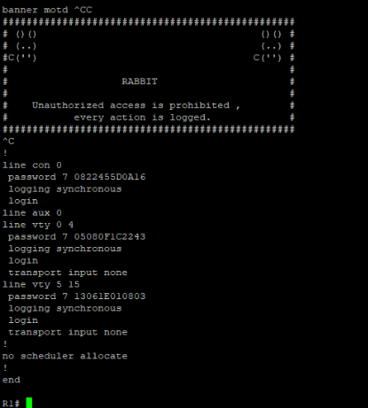
**\

**Конфигурация R2:**

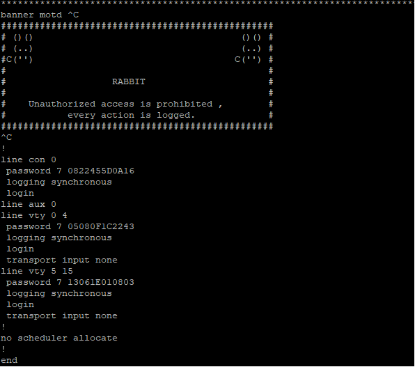
**\

**Настройка интерфейсов и маршрутизации:**

**Конфигурация R1:**

**

**Конфигурация R2:**

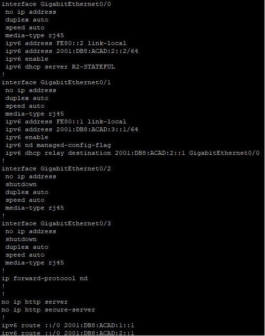

**Проверка связности между маршрутизаторами:**

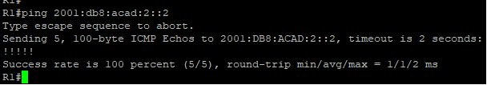
**\

**Часть 2: Проверка SLAAC на PC-A**

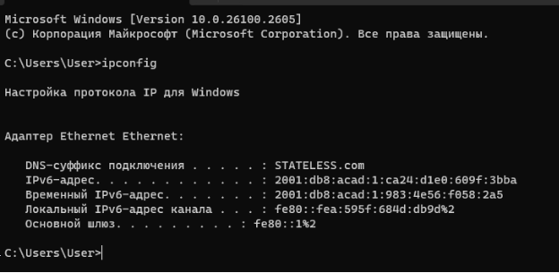

**Часть 3: Настройка DHCPv6 без отслеживания состояния (Stateless) на R1**

**Создание пула DHCPv6:**

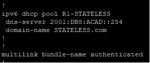

**Настройка интерфейса Gi0/1 на R1 для Stateless DHCPv6:**

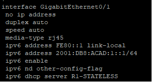

**Настройка интерфейса Gi0/1 на R1 для Stateless DHCPv6:**

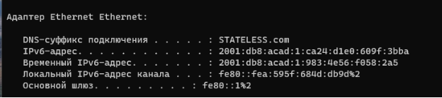

**Часть 4: Настройка DHCPv6 с отслеживанием состояния (Stateful) на R1**

**Создание пула DHCPv6 для сети PC-B:**

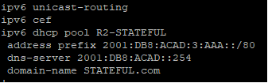

**Назначение пула DHCPv6 интерфейсу Gi0/0 на R1**

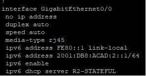

` `**Часть 5: Настройка DHCPv6 Relay на R2**

**Настройка ретрансляции DHCPv6 на интерфейсе Gi0/1 на R2:**

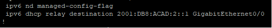
**\

**Проверка состояния интерфейса R2 Gi0/1:**

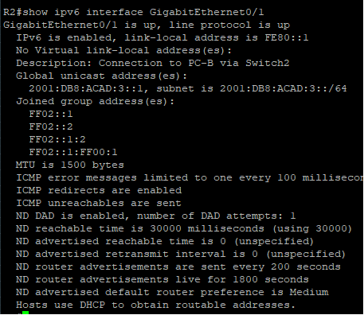

