Задание №1

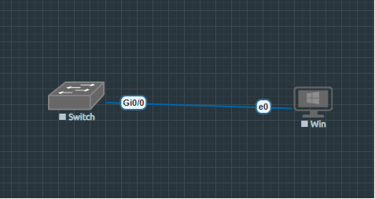

` `Рис.1 - Топология в EVE-NG: коммутатор SW1 и виртуальный ПК

` `**Проверка конфигурации коммутатора по умолчанию**

**Шаг 1: Подключение к консоли и переход в привилегированный режим.**\
В EVE-NG выполнено: **Правый клик на S1 -> Open Console (HTML5)**.

Код:

Switch> enable

Switch#

Ответ на вопрос в методички: Консольное подключение необходимо, так как изначально у коммутатора нет настроенного IP-адреса для удаленного доступа (Telnet/SSH) и не настроены учетные данные для vty-линий.

` `**Проверка текущей конфигурации (running-config).**

Switch# show running-config

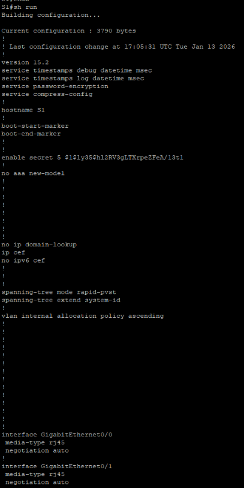

Вывод команды show running-config

Ответ на вопросы по конфигурации :

- **Количество интерфейсов FastEthernet:** 24 (F0/1 - F0/24)
- **Количество интерфейсов GigabitEthernet:** 2 (G0/1, G0/2)
- **Диапазон vty-линий:** 0 4 и 5 15 (всего 16 линий: 0-15)

**Проверка загрузочной конфигурации (startup-config).**

**Команда** 

Switch# show startup-config

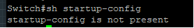

Рис.3 - Отсутствие сохраненной конфигурации

**Ответ на вопрос:** Сообщение появляется потому, что в NVRAM отсутствует сохраненный файл конфигурации (startup-config).

` `**Изучение SVI для VLAN 1**

Команда

Switch# show interface vlan 1

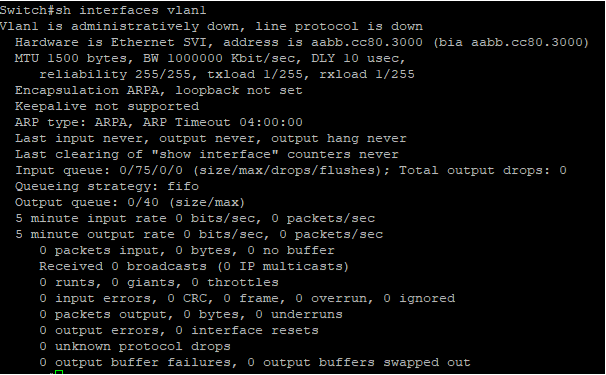

**Ответы на вопросы методички:**

1. **Назначен ли IP-адрес сети VLAN 1?**\
   В IOL интерфейс VLAN 1 изначально отсутствует. После его создания командой interface vlan 1 IP-адрес не назначен, что подтверждается строкой "Internet protocol processing disabled".

   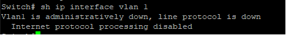

1. **Какой MAC-адрес имеет SVI?**\
   После создания интерфейса назначен MAC-адрес: aabb.cc00.0100 (типичный для виртуальных устройств IOL).
1. **Данный интерфейс включен?**\
   Нет, после создания статус administratively down, line protocol down.

**Подключение кабеля и активация интерфейса**

В IOL после подключения PC-A к порту F0/6 необходимо:

1. **Включить интерфейс VLAN 1:**

S1# configure terminal

S1(config)# interface vlan 1

S1(config-if)# no shutdown

S1(config-if)# end

2. **Проверить состояние:**

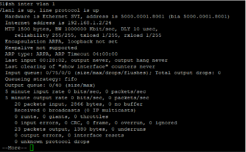S1# show interface vlan 1

Рис.5 - Интерфейс VLAN 1 после выполнения no shutdown. Статус изменился на "up/up"

Проверка флеш-памяти

Команда:

S1#dir flash:

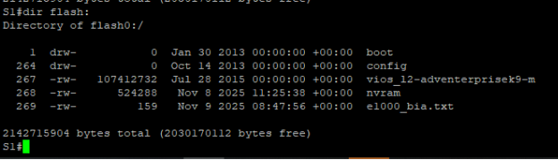

Рис.6 - Содержимое флеш-памяти коммутатора IOL

**Ответ на вопрос:**\
Имя образа Cisco IOS в IOL: i86bi-linux-l2-adventerprisek9-15.2a.bin (или аналогичное, в зависимости от версии образа).

` `**Настройка базовых параметров устройства**

**Настройка базовых параметров коммутатора**

Switch# configure terminal

Switch(config)# no ip domain-lookup

Switch(config)# hostname S1

S1(config)# service password-encryption

S1(config)# enable secret class

S1(config)# banner motd #Unauthorized access is strictly prohibited.#

**Настройка IP-адреса на SVI (VLAN 1)**

S1(config)# interface vlan 1

S1(config-if)# ip address 192.168.1.2 255.255.255.0

S1(config-if)# no shutdown

S1(config-if)# exit

S1(config)# ip default-gateway 192.168.1.1
**\

**Настройка консольного доступа**

S1(config)# line console 0

S1(config-line)# password cisco

S1(config-line)# login

S1(config-line)# logging synchronous

S1(config-line)# exit

**Настройка виртуальных терминальных линий (vty)**

S1(config)# line vty 0 15

S1(config-line)# password cisco

S1(config-line)# login

S1(config-line)# exit

S1(config)# end

S1# write memory

**Ответ на вопрос:**\
Команда login указывает коммутатору требовать аутентификацию (ввод пароля) при попытке подключения к vty-линиям. Без этой команды удаленное подключение было бы возможно без пароля, что является нарушением безопасности.

` `**Настройка IP-адреса на PC-A**

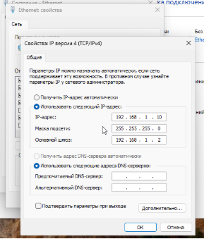

Рис.7 - Настройка статического IP-адреса на PC

** Проверка сетевых подключений

Отображение итоговой конфигурации

S1# show running-config

Резкльтат команды \
S1#sh run

Building configuration...

Current configuration : 3790 bytes

!

! Last configuration change at 17:05:31 UTC Tue Jan 13 2026

!

version 15.2

service timestamps debug datetime msec

service timestamps log datetime msec

service password-encryption

service compress-config

!

hostname S1

!

boot-start-marker

boot-end-marker

!

!

enable secret 5 $1$ly35$hl2RV3gLTXrpeZFeA/13t1

!

no aaa new-model

!

!

!

!

!

!

!

!

no ip domain-lookup

ip cef

no ipv6 cef

!

!

!

spanning-tree mode rapid-pvst

spanning-tree extend system-id

!

vlan internal allocation policy ascending

!

!

!

!

!

!

!

!

!

!

!

!

!

!

interface GigabitEthernet0/0

` `media-type rj45

` `negotiation auto

!

interface GigabitEthernet0/1

` `media-type rj45

` `negotiation auto

!

interface GigabitEthernet0/2

` `media-type rj45

` `negotiation auto

!

interface GigabitEthernet0/3

` `media-type rj45

` `negotiation auto

!

interface GigabitEthernet1/0

` `media-type rj45

` `negotiation auto

!

interface GigabitEthernet1/1

` `media-type rj45

` `negotiation auto

!

interface GigabitEthernet1/2

` `media-type rj45

` `negotiation auto

!

interface GigabitEthernet1/3

` `media-type rj45

` `negotiation auto

!

interface Vlan1

` `ip address 192.168.1.2 255.255.255.0

!

ip forward-protocol nd

!

no ip http server

no ip http secure-server

!

!

!

!

!

!

control-plane

!

banner exec ^C

\*\*\*\*\*\*\*\*\*\*\*\*\*\*\*\*\*\*\*\*\*\*\*\*\*\*\*\*\*\*\*\*\*\*\*\*\*\*\*\*\*\*\*\*\*\*\*\*\*\*\*\*\*\*\*\*\*\*\*\*\*\*\*\*\*\*\*\*\*\*\*\*\*\*

\* IOSv is strictly limited to use for evaluation, demonstration and IOS  \*

\* education. IOSv is provided as-is and is not supported by Cisco's      \*

\* Technical Advisory Center. Any use or disclosure, in whole or in part, \*

\* of the IOSv Software or Documentation to any third party for any       \*

\* purposes is expressly prohibited except as otherwise authorized by     \*

\* Cisco in writing.                                                      \*

\*\*\*\*\*\*\*\*\*\*\*\*\*\*\*\*\*\*\*\*\*\*\*\*\*\*\*\*\*\*\*\*\*\*\*\*\*\*\*\*\*\*\*\*\*\*\*\*\*\*\*\*\*\*\*\*\*\*\*\*\*\*\*\*\*\*\*\*\*\*\*\*\*\*^C

banner incoming ^C

\*\*\*\*\*\*\*\*\*\*\*\*\*\*\*\*\*\*\*\*\*\*\*\*\*\*\*\*\*\*\*\*\*\*\*\*\*\*\*\*\*\*\*\*\*\*\*\*\*\*\*\*\*\*\*\*\*\*\*\*\*\*\*\*\*\*\*\*\*\*\*\*\*\*

\* IOSv is strictly limited to use for evaluation, demonstration and IOS  \*

\* education. IOSv is provided as-is and is not supported by Cisco's      \*

\* Technical Advisory Center. Any use or disclosure, in whole or in part, \*

\* of the IOSv Software or Documentation to any third party for any       \*

\* purposes is expressly prohibited except as otherwise authorized by     \*

\* Cisco in writing.                                                      \*

\*\*\*\*\*\*\*\*\*\*\*\*\*\*\*\*\*\*\*\*\*\*\*\*\*\*\*\*\*\*\*\*\*\*\*\*\*\*\*\*\*\*\*\*\*\*\*\*\*\*\*\*\*\*\*\*\*\*\*\*\*\*\*\*\*\*\*\*\*\*\*\*\*\*^C

banner login ^C

\*\*\*\*\*\*\*\*\*\*\*\*\*\*\*\*\*\*\*\*\*\*\*\*\*\*\*\*\*\*\*\*\*\*\*\*\*\*\*\*\*\*\*\*\*\*\*\*\*\*\*\*\*\*\*\*\*\*\*\*\*\*\*\*\*\*\*\*\*\*\*\*\*\*

\* IOSv is strictly limited to use for evaluation, demonstration and IOS  \*

\* education. IOSv is provided as-is and is not supported by Cisco's      \*

\* Technical Advisory Center. Any use or disclosure, in whole or in part, \*

\* of the IOSv Software or Documentation to any third party for any       \*

\* purposes is expressly prohibited except as otherwise authorized by     \*

\* Cisco in writing.                                                      \*

\*\*\*\*\*\*\*\*\*\*\*\*\*\*\*\*\*\*\*\*\*\*\*\*\*\*\*\*\*\*\*\*\*\*\*\*\*\*\*\*\*\*\*\*\*\*\*\*\*\*\*\*\*\*\*\*\*\*\*\*\*\*\*\*\*\*\*\*\*\*\*\*\*\*^C

banner motd ^C

################################################

\# ()()                                    ()() #

\# (..)                                    (..) #

#C(\_\_)                                   C(\_\_) #

\#                                              #

\#                                              #

\#           Hi, Network Engineer!              #

\#                                              #

\#  Unauthorized access is strictly prohibited. #

\#                                              #

################################################

^C

!

line con 0

` `password 7 0307570A151C

` `logging synchronous

` `login

line aux 0

` `login

line vty 0 4

` `password 7 110A1016141D

` `login

line vty 5 15

` `password 7 110A1016141D

` `login

!

!

End

**Проверка VLAN 1:**

S1# show interface vlan 1

Полоса пропускания: 1000000 Kbit (1 Gbit) — виртуальная характеристика в IOL.

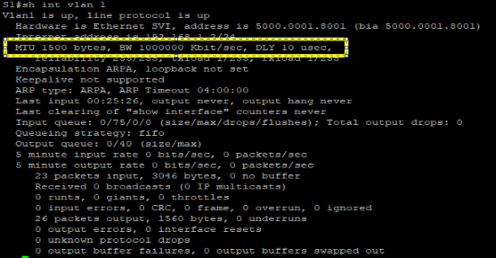

**Тестирование сквозного соединения**

На PC-A выполнены команды:

ping 192.168.1.10

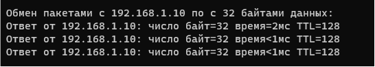

ping 192.168.1.2

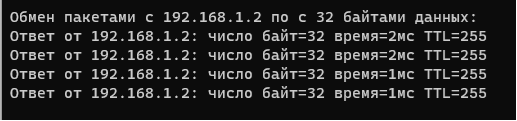

` `**Проверка удаленного управления через Telnet**

Логин: cisco (пароль VTY)\
Привилегированный режим: class (enable secret*)*

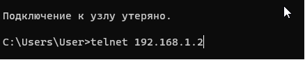

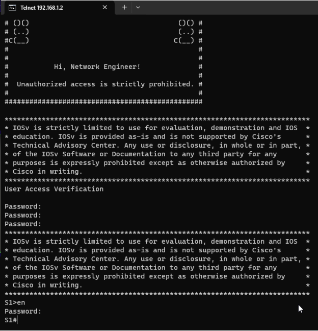

**Ответы на контрольные вопросы**

1. **Зачем необходимо настраивать пароль VTY для коммутатора?**\
   Пароль VTY необходим для аутентификации администраторов при удаленном подключении по Telnet или SSH. Без пароля (и команды login) удаленный доступ был бы возможен без какой-либо проверки, что представляет серьезную угрозу безопасности.
1. **Что нужно сделать, чтобы пароли не отправлялись в незашифрованном виде?**\
   Для шифрования паролей в файле конфигурации используется команда service password-encryption. Однако для безопасной передачи паролей по сети необходимо использовать протокол SSH вместо Telnet, так как Telnet передает все данные (включая пароли) в открытом виде.

