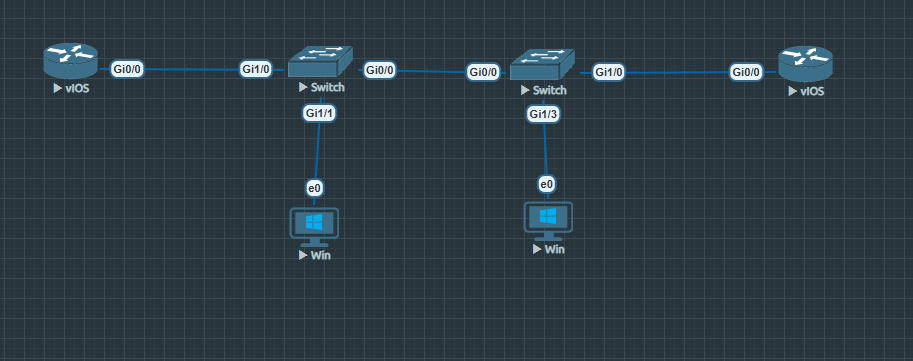
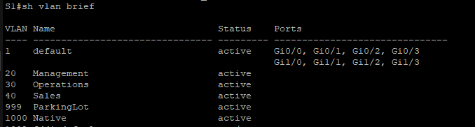
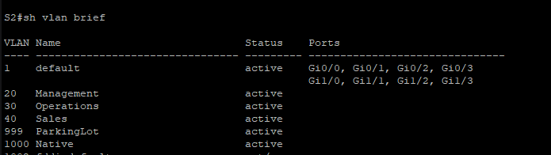
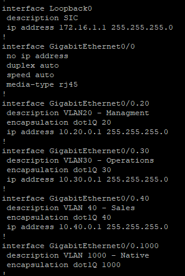
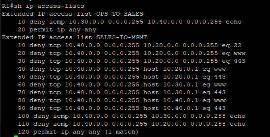
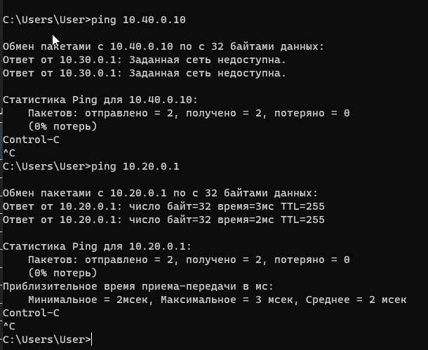
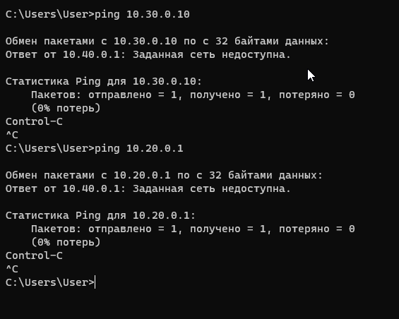
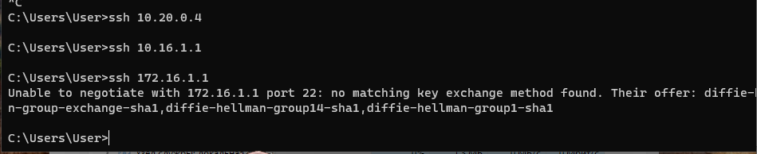
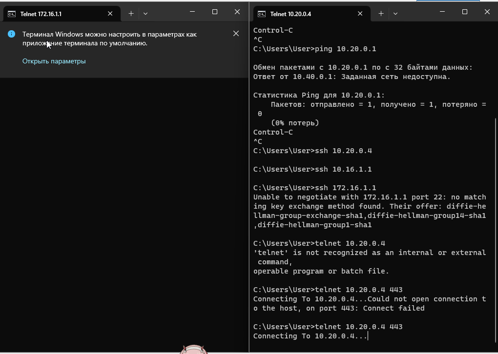

Задание 12

Топология сети

{width="6.496527777777778in" height="2.56875in"}

Таблица адресации

  ---------------------------------------------------------------------------
  Устройство     Интерфейс      IP-адрес       Маска подсети   Шлюз по
                                                               умолчанию
  -------------- -------------- -------------- --------------- --------------
  R1             G0/0/1         ---            ---             ---

  R1             G0/0/1.20      10.20.0.1      255.255.255.0   ---

  R1             G0/0/1.30      10.30.0.1      255.255.255.0   ---

  R1             G0/0/1.40      10.40.0.1      255.255.255.0   ---

  R1             G0/0/1.1000    ---            ---             ---

  R1             Loopback1      172.16.1.1     255.255.255.0   ---

  R2             G0/0/1         10.20.0.4      255.255.255.0   ---

  S1             VLAN 20        10.20.0.2      255.255.255.0   10.20.0.1

  S2             VLAN 20        10.20.0.3      255.255.255.0   10.20.0.1

  PC-A           NIC            10.30.0.10     255.255.255.0   10.30.0.1

  PC-B           NIC            10.40.0.10     255.255.255.0   10.40.0.1
  ---------------------------------------------------------------------------

  : В этой таблице показаны адреса для устройства, интерфейса,
  IP-адреса, маски подсети и шлюза по умолчанию, где это применимо.

Таблица Vlan

+------------------+------------------+-------------------------------+
| VLAN             | Имя              | Назначенный интерфейс         |
+==================+==================+===============================+
| 20               | Management       | S2: F0/5                      |
+------------------+------------------+-------------------------------+
| 30               | Operations       | S1: F0/6                      |
+------------------+------------------+-------------------------------+
| 40               | Sales            | S2: F0/18                     |
+------------------+------------------+-------------------------------+
| 999              | ParkingLot       | S1: F0/2-4, F0/7-24, G0/1-2   |
|                  |                  |                               |
|                  |                  | S2: F0/2-4, F0/6-17,          |
|                  |                  | F0/19-24, G0/1-2              |
+------------------+------------------+-------------------------------+
| 1000             | Собственная      | ---                           |
+------------------+------------------+-------------------------------+

: В этой таблице показаны имена vlan, vlan и назначенные интерфейсы, где
это применимо.

**Шаг 1: Базовая настройка маршрутизаторов**

**На R1:**

Router\> enable

Router# configure terminal

Router(config)# hostname R1

R1(config)# enable secret class

R1(config)# service password-encryption

R1(config)# line console 0

R1(config-line)# password cisco

R1(config-line)# login

R1(config-line)# exit

R1(config)# line vty 0 15

R1(config-line)# password cisco

R1(config-line)# login

R1(config-line)# exit

R1(config)# no ip domain-lookup

R1(config)# banner motd \# Unauthorized access is prohibited! \#

R1(config)# exit

R1# copy run st

**На R2:**

Router\> enable

Router# configure terminal

Router(config)# hostname R2

R2(config)# enable secret class

R2(config)# service password-encryption

R2(config)# line console 0

R2(config-line)# password cisco

R2(config-line)# login

R2(config-line)# exit

R2(config)# line vty 0 15

R2(config-line)# password cisco

R2(config-line)# login

R2(config-line)# exit

R2(config)# no ip domain-lookup

R2(config)# banner motd \# Unauthorized access is prohibited! \#

R2(config)# exit

R2# copy run st

Шаг 2: Базовая настройка коммутаторов

**На S1:**

Switch\> enable

Switch# configure terminal

Switch(config)# hostname S1

S1(config)# enable secret class

S1(config)# service password-encryption

S1(config)# line console 0

S1(config-line)# password cisco

S1(config-line)# login

S1(config-line)# exit

S1(config)# line vty 0 15

S1(config-line)# password cisco

S1(config-line)# login

S1(config-line)# exit

S1(config)# no ip domain-lookup

S1(config)# banner motd \# Unauthorized access is prohibited! \#

S1(config)# exit

S1# copy run st

**На S2:**

Switch\> enable

Switch# configure terminal

Switch(config)# hostname S2

S2(config)# enable secret class

S2(config)# service password-encryption

S2(config)# line console 0

S2(config-line)# password cisco

S2(config-line)# login

S2(config-line)# exit

S2(config)# line vty 0 15

S2(config-line)# password cisco

S2(config-line)# login

S2(config-line)# exit

S2(config)# no ip domain-lookup

S2(config)# banner motd \# Unauthorized access is prohibited! \#

S2(config)# exit

S2# copy run st

**Шаг 3: Настройка VLAN на коммутаторах**

**На S1:**

{width="6.496527777777778in" height="1.74375in"}

**На S2:**

{width="6.496527777777778in"
height="1.8319444444444444in"}

**Шаг 4: Настройка интерфейса управления и шлюза по умолчанию**

**На S1:**

S1(config)# interface vlan 20

S1(config-if)# ip address 10.20.0.2 255.255.255.0

S1(config-if)# no shutdown

S1(config-if)# exit

S1(config)# ip default-gateway 10.20.0.1

**На S2:**

S2(config)# interface vlan 20

S2(config-if)# ip address 10.20.0.3 255.255.255.0

S2(config-if)# no shutdown

S2(config-if)# exit

S2(config)# ip default-gateway 10.20.0.1

**Шаг 5: Настройка неиспользуемых портов**

**На S1:**

S1(config)# int ra gi0/1-3,gi1/2-3

S1(config-if-range)# switchport mode access

S1(config-if-range)# switchport access vlan 999

S1(config-if-range)# shutdown

S1(config-if-range)# description ParkingLot

S1(config-if-range)# exit

**На S2:**

S2(config)# int ra gi 0/1-3 , gi 1/1-2

S2(config-if-range)# switchport mode access

S2(config-if-range)# switchport access vlan 999

S2(config-if-range)# shutdown

S2(config-if-range)# description ParkingLot

S2(config-if-range)# exit

**Шаг 6: Назначение портов доступа**

**На S1:**

S1(config)# interface G1/1

S1(config-if)# switchport mode access

S1(config-if)# switchport access vlan 30

S1(config-if)# description PC-A Connection (VLAN 30 - Operations)

S1(config-if)# no shutdown

S1(config-if)# exit

**На S2:**

S2(config)# interface G1/3

S2(config-if)# switchport mode access

S2(config-if)# switchport access vlan 40

S2(config-if)# description PC-B Connection (VLAN 40 - Sales)

S2(config-if)# no shutdown

S2(config-if)# exit

**Шаг 7: Настройка транков**

**Транк между S1 и S2:**

S1(config)# interface G0/0

S1(config-if)# switchport mode trunk

S1(config-if)# switchport trunk native vlan 1000

S1(config-if)# switchport trunk allowed vlan 20,30,40,1000

S1(config-if)# description Trunk to S2

S1(config-if)# no shutdown

S1(config-if)# exit

S2(config)# interface G0/0

S2(config-if)# switchport mode trunk

S2(config-if)# switchport trunk native vlan 1000

S2(config-if)# switchport trunk allowed vlan 20,30,40,1000

S2(config-if)# description Trunk to S1

S2(config-if)# no shutdown

S2(config-if)# exit

**Транк между S1 и R1:**

S1(config)# interface f0/5

S1(config-if)# switchport mode trunk

S1(config-if)# switchport trunk native vlan 1000

S1(config-if)# switchport trunk allowed vlan 20,30,40,1000

S1(config-if)# description Trunk to R1

S1(config-if)# no shutdown

S1(config-if)# exit

**Шаг 8: Настройка маршрутизации на R1**

{width="3.240034995625547in"
height="4.844425853018373in"}

**Шаг 9: Настройка R2**

R2(config)# interface g0/0/1

R2(config-if)# ip address 10.20.0.4 255.255.255.0

R2(config-if)# no shutdown

R2(config-if)# exit

R2(config)# ip route 0.0.0.0 0.0.0.0 10.20.0.1

**Шаг 10: Настройка SSH на всех устройствах**

R1(config)# username admin privilege 15 secret pass

R1(config)# ip domain-name otus-lab.com

R1(config)# crypto key generate rsa modulus 1024

R1(config)# line vty 0 4

R1(config-line)# transport input ssh

R1(config-line)# login local

R1(config-line)# exit

R1(config)# ip http secure-server

R1(config)# ip http authentication local

**\
**

**Часть 2: Настройка и проверка расширенных ACL**

**Настройка ACL на R1:**

R1(config)# ip access-list extended SALES-TO-MGMT

R1(config-ext-nacl)# remark Policy 1: Deny SSH from Sales to Management

R1(config-ext-nacl)# deny tcp 10.40.0.0 0.0.0.255 10.20.0.0 0.0.0.255 eq
22

R1(config-ext-nacl)# remark Policy 2: Deny HTTP/HTTPS from Sales to
Management and R1 interfaces

R1(config-ext-nacl)# deny tcp 10.40.0.0 0.0.0.255 10.20.0.0 0.0.0.255 eq
80

R1(config-ext-nacl)# deny tcp 10.40.0.0 0.0.0.255 10.20.0.0 0.0.0.255 eq
443

R1(config-ext-nacl)# deny tcp 10.40.0.0 0.0.0.255 host 10.20.0.1 eq 80

R1(config-ext-nacl)# deny tcp 10.40.0.0 0.0.0.255 host 10.20.0.1 eq 443

R1(config-ext-nacl)# deny tcp 10.40.0.0 0.0.0.255 host 10.30.0.1 eq 80

R1(config-ext-nacl)# deny tcp 10.40.0.0 0.0.0.255 host 10.30.0.1 eq 443

R1(config-ext-nacl)# deny tcp 10.40.0.0 0.0.0.255 host 10.40.0.1 eq 80

R1(config-ext-nacl)# deny tcp 10.40.0.0 0.0.0.255 host 10.40.0.1 eq 443

R1(config-ext-nacl)# remark Policy 3: Deny ICMP from Sales to Operations
and Management

R1(config-ext-nacl)# deny icmp 10.40.0.0 0.0.0.255 10.30.0.0 0.0.0.255
echo

R1(config-ext-nacl)# deny icmp 10.40.0.0 0.0.0.255 10.20.0.0 0.0.0.255
echo

R1(config-ext-nacl)# permit ip any any

R1(config-ext-nacl)# exit

R1(config)# ip access-list extended OPS-TO-SALES

R1(config-ext-nacl)# remark Policy 4: Deny ICMP from Operations to Sales

R1(config-ext-nacl)# deny icmp 10.30.0.0 0.0.0.255 10.40.0.0 0.0.0.255
echo

R1(config-ext-nacl)# permit ip any any

R1(config-ext-nacl)# exit

**Применение ACL на интерфейсах:**

R1(config)# interface g0/0/1.40

R1(config-subif)# ip access-group SALES-TO-MGMT in

R1(config-subif)# exit

R1(config)# interface g0/0/1.30

R1(config-subif)# ip access-group OPS-TO-SALES in

R1(config-subif)# exit

**Проверка работы ACL**

{width="5.729966097987751in"
height="2.906655730533683in"}

PC-A

{width="6.355053587051619in"
height="5.198641732283464in"}

PC -- B

{width="5.886237970253719in"
height="4.708990594925634in"}

{width="6.496527777777778in"
height="1.3277777777777777in"}

{width="6.496527777777778in"
height="4.623611111111111in"}
